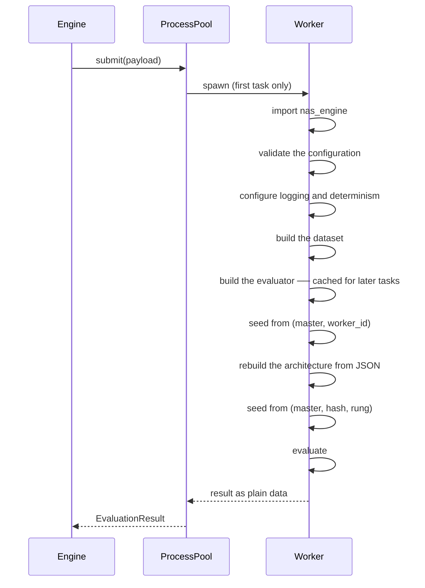

# Concurrency

Two execution modes, what parallelism buys, and — stated honestly — what it costs.

## The two modes

| Aspect                | Sequential             | Multiprocessing                       |
| --------------------- | ---------------------- | ------------------------------------- |
| Where evaluations run | In the calling process | Across worker processes               |
| Configuration         | `mode: sequential`     | `mode: multiprocessing`, `workers: N` |
| Reproducible          | **Yes**, bit-identical | Repeatable in distribution only       |
| Speed-up              | 1×                     | Up to *N*× on *N* cores               |
| Latency measurements  | Clean                  | Noisier and systematically slower     |
| Default               | ✅                     |                                       |

Sequential is the default because every reproducibility guarantee in this project is stated
for it, and because for small searches the speed-up does not repay the loss.

## The executor interface

Both modes satisfy one interface, so the engine's logic is identical either way and can be
tested entirely sequentially:

```python
class EvaluationExecutor(ABC):
    @property
    def max_in_flight(self) -> int: ...
    @property
    def mode(self) -> str: ...
    def run_batch(self, tasks: list[EvaluationTask]) -> list[EvaluationResult]: ...
    def shutdown(self) -> None: ...
```

`run_batch` returns results **in the same order as the input tasks**, regardless of the
order in which they completed. Ordering the output makes the engine's bookkeeping
deterministic even when execution is not.

## Batch semantics, and the trade-off

Both backends expose `run_batch`: submit a list, get back every result. This is a
**barrier** — the engine waits for the slowest task in a batch before proceeding.

A streaming futures interface would keep workers marginally busier. It would also make the
engine's checkpointing and state transitions much harder to reason about: "what is the
engine's state?" becomes a question about partially completed batches. Every strategy here
already has natural batch boundaries — successive halving *requires* one — so the barrier
costs little.

The cost is real when task durations vary widely: a batch of four where one candidate takes
ten times as long leaves three workers idle. Mitigation: keep `max_in_flight` modest, or set
`budget.max_seconds_per_evaluation` so a pathological candidate cannot stall a batch
indefinitely. Recorded in [ADR 0004](../adr/0004-concurrency-model.md).

## Why `spawn`

```yaml
concurrency:
  mode: multiprocessing
  workers: 4
  start_method: spawn      # the default
```

`fork` inherits the parent's entire memory image — and that is precisely why it is not the
default. Forking a process that has already initialised CUDA, or a threaded BLAS library,
produces a child with a broken runtime. The symptom is a hang with no error message, and
diagnosing it is miserable.

`spawn` starts a fresh interpreter. Nothing is inherited: no imported modules, no open
database handles, no loaded dataset, no logging configuration. Everything the worker needs
arrives as a picklable payload and is rebuilt on arrival. Slower to start, and correct.

`forkserver` is offered as a middle ground on Linux: a clean server process is forked once
before any library is initialised, and workers fork from it.

## What a worker does



Four properties:

**The payload is plain data.** Configuration, architecture, and budget cross as
dictionaries, never as live objects. No custom class needs to be picklable.

**Expensive setup is cached per process.** Building the dataset and evaluator costs real
time; the first task in a worker builds them and every later task reuses them. The cache is
keyed by configuration hash, so a worker handed a different configuration rebuilds rather
than silently using the wrong one.

**Seeds are derived, never shared.** The worker seeds itself from `(master, worker_id)`;
each candidate seeds itself from its architecture hash. Two workers never draw the same
weights, and a candidate's weights do not depend on which worker ran it.

**No exception escapes.** An exception crossing a process boundary loses its traceback and
can fail to unpickle. Failures are classified and returned as data — including failures in
the *failure path* itself, which is why `_safe_budget` exists.

## The four requirements

### 1. No two workers evaluate the same architecture

Two mechanisms, deliberately redundant:

- **Claiming is atomic.** `claim_next_queued` selects and updates in one transaction. SQLite
  serialises writers, so exactly one worker wins; the loser sees the row already in
  `RUNNING`.
- **Identity is unique in the database.** `(search_id, architecture_hash, rung)` is a unique
  constraint. Even if two proposals raced past the lookup, the second insert fails and is
  translated into a duplicate.

Belt and braces, because the failure mode — silently spending two full evaluation budgets
on the same network — is invisible in the output.

### 2. Database writes stay consistent

Every repository method is one transaction; a failure rolls the whole thing back.
`busy_timeout=30000` handles write-lock contention: without it SQLite raises
`database is locked` immediately, and with it the writer waits and usually succeeds.

`journal_mode=WAL` lets readers proceed while a writer holds the lock, so
`nas-engine status` works during a search.

### 3. Worker failures do not corrupt state

A worker that dies takes its result with it. The parent notices the broken future and
converts it into a retriable `WorkerError` failure, so the rest of the batch is unaffected
and the retry policy applies:

```python
except BaseException as error:
    worker_error = WorkerError(f"worker process failed while evaluating candidate …")
    results[index] = EvaluationResult(succeeded=False,
                                      failure=EvaluationFailure.from_exception(worker_error),
                                      worker_id="dead")
```

If the *parent* dies, the candidate is left in `RUNNING` and the
[recovery sweep](system-overview.md#resume-and-recovery-flow) finds it on resume.

### 4. Random number generation is isolated per worker

Covered by the derived-seed scheme. The property that matters:

```python
bundle = SeedBundle.from_master(42)
assert bundle.for_worker(0).to_dict() != bundle.for_worker(1).to_dict()
```

Without it, concurrent workers would initialise identical weights and augment data
identically, silently reducing the search's effective diversity.

## Logging under concurrency

Interleaved output from four workers is unreadable unless every line says who wrote it.
Every event carries:

| Field               | Meaning            |
| ------------------- | ------------------ |
| `search_id`         | Which run          |
| `candidate_id`      | Which candidate    |
| `architecture_hash` | Which architecture |
| `trial_id`          | Which attempt      |
| `worker_id`         | Which process      |

With `logging.format: json`, filtering is a `jq` away:

```bash
nas-engine search --config c.yaml --set logging.format=json 2> run.jsonl
jq -c 'select(.worker_id == "2")' run.jsonl
```

## What concurrency changes — the honest answer

**It does not change any individual candidate's result.** Each candidate's seed comes from
its architecture hash, so its weights, data order, and measured accuracy are independent of
which worker ran it and of what ran before it.

**It does change:**

| What changes                                  | Why                                                                     |
| --------------------------------------------- | ----------------------------------------------------------------------- |
| **Completion order**                          | Results arrive as workers finish, not in dispatch order                 |
| **Adaptive strategies' subsequent proposals** | Evolution and successive halving see a different observation *sequence* |
| **Measured latency**                          | Workers contend for cores and memory bandwidth                          |
| **Wall-clock durations**                      | Same reason                                                             |

The summary, and it is stated this plainly in the code:

> **Sequential execution is reproducible; multiprocessing is repeatable in distribution but
> not identical run to run.**

The determinism tests only assert bit-identity for sequential runs. That is not a gap in
the tests; it is an accurate statement of what is true.

## Choosing a worker count

| Situation                | Guidance                                                                            |
| ------------------------ | ----------------------------------------------------------------------------------- |
| CPU-bound, no GPU        | `workers ≈ physical cores − 1`                                                      |
| One GPU                  | `workers = 1`. Several processes on one GPU contend for memory and serialise anyway |
| Several GPUs             | One worker per GPU, with `CUDA_VISIBLE_DEVICES` set per worker                      |
| Measuring latency        | `workers = 1`. Contention makes the numbers meaningless                             |
| Reproducibility required | `mode: sequential`                                                                  |

Oversubscription is warned about rather than silently accepted:

```text
[warning] executor.oversubscribed  workers=16 cpu_count=8
          note='workers exceed available cores; latency metrics will be inflated'
```

Set `OMP_NUM_THREADS=1` and `MKL_NUM_THREADS=1` when using multiple workers. Otherwise each
worker spawns its own BLAS thread pool and *N* workers × *M* threads oversubscribe the
machine badly. The Dockerfile sets both.

## Strategies that need a barrier

`SearchStrategy.requires_synchronous_observations` lets a strategy force one outstanding
evaluation at a time. None of the shipped strategies sets it: successive halving's barrier
is expressed instead by `propose` returning an empty list while a rung is incomplete, which
still permits concurrency *within* a rung.

A strategy that adapts after every single observation — a Bayesian optimiser fitting a
surrogate, say — would set it.

## The distributed boundary

This project supports **local single-process** and **local multiprocessing**. It does not
support distributed execution across machines, and it does not pretend to.

What would be needed, and why none of it is here:

| Requirement                                 | Why it is absent                                    |
| ------------------------------------------- | --------------------------------------------------- |
| A shared database reachable from every node | SQLite is a local file; PostgreSQL would be needed  |
| A work queue with leases and heartbeats     | Claiming currently relies on SQLite's writer lock   |
| Artifact storage every node can reach       | Artifacts are local paths                           |
| Node failure detection                      | The recovery sweep runs at resume, not continuously |
| Configuration and code distribution         | Workers currently share the parent's installation   |

The extension points already exist. `EvaluationExecutor` is the seam: a
`DistributedExecutor` implementing `run_batch` would need no engine change.
`SearchRepository` is the other: SQLAlchemy already speaks PostgreSQL. What is missing is
the operational machinery, and adding it speculatively would be complexity without a user.

## Testing concurrency

Concurrency is hard to test, so the design makes most of it testable *without* concurrency:

| What | How |
| --- | --- |
| Worker logic | `evaluate_task` called **in-process** — [`tests/integration/test_worker_process.py`](../../tests/integration/test_worker_process.py) |
| Payload contract | JSON round-trip of the returned payload |
| Evaluator caching | Inspecting `_WORKER_CACHE` directly |
| Nothing escapes the worker | Corrupting each payload field in turn |
| Dead workers | A payload the worker cannot validate |
| Atomic claiming | Two `claim_next_queued` calls; the second returns `None` |
| Duplicate insertion | Asserting `DuplicateRecordError` |
| The real spawned path | One `slow`-marked end-to-end test |

That last one is deliberately minimal: a spawned-process test is slow and its failures are
hard to attribute. The in-process tests cover the logic; the spawned test covers the wiring.

## See also

- [ADR 0004](../adr/0004-concurrency-model.md) — the decision and its alternatives.
- [Reproducibility](../concepts/reproducibility.md) — the seeding scheme in full.
- [Production runbook](../operations/production-runbook.md) — operating a parallel search.
