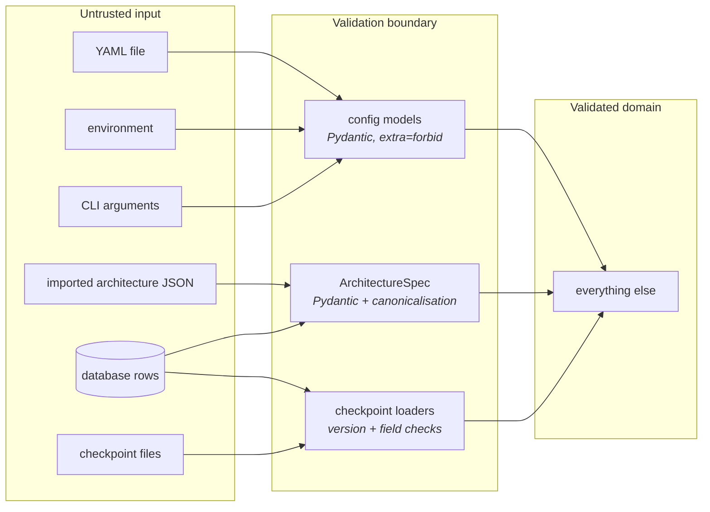
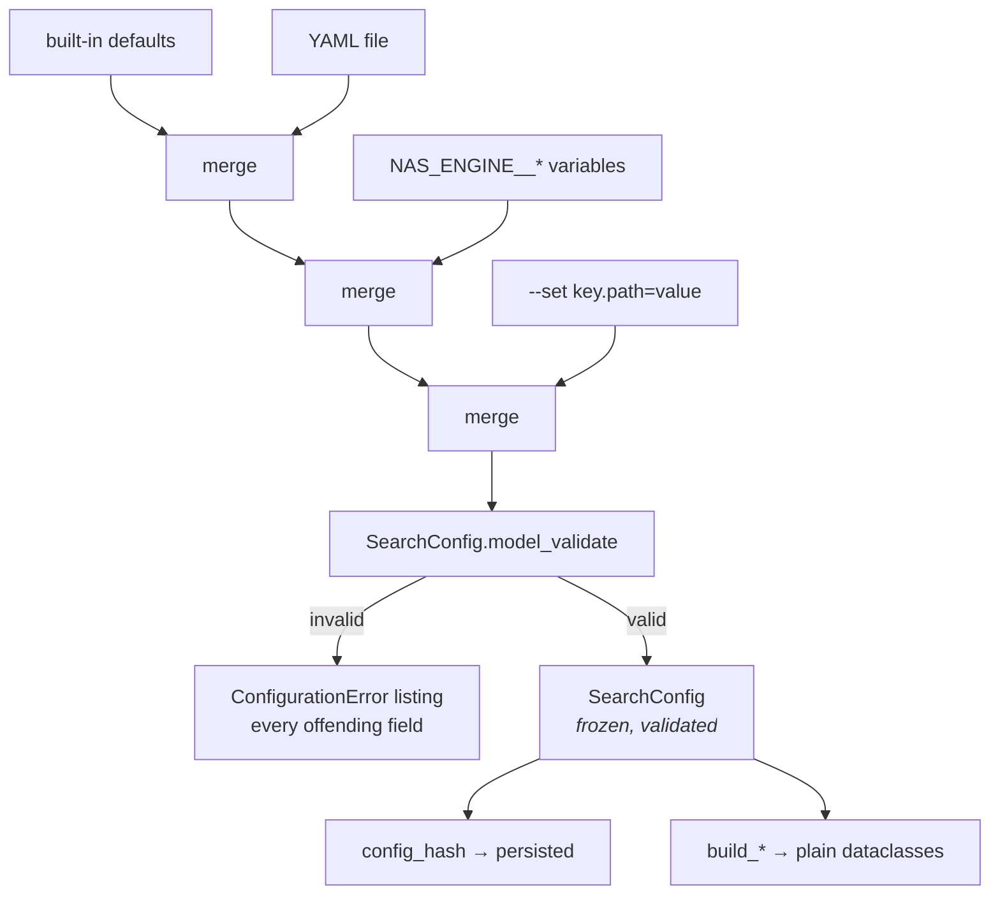
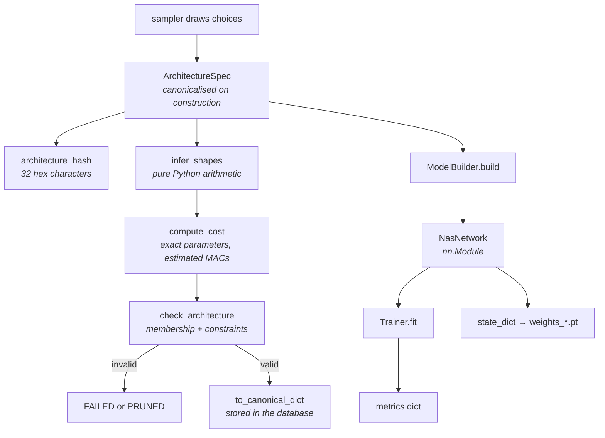
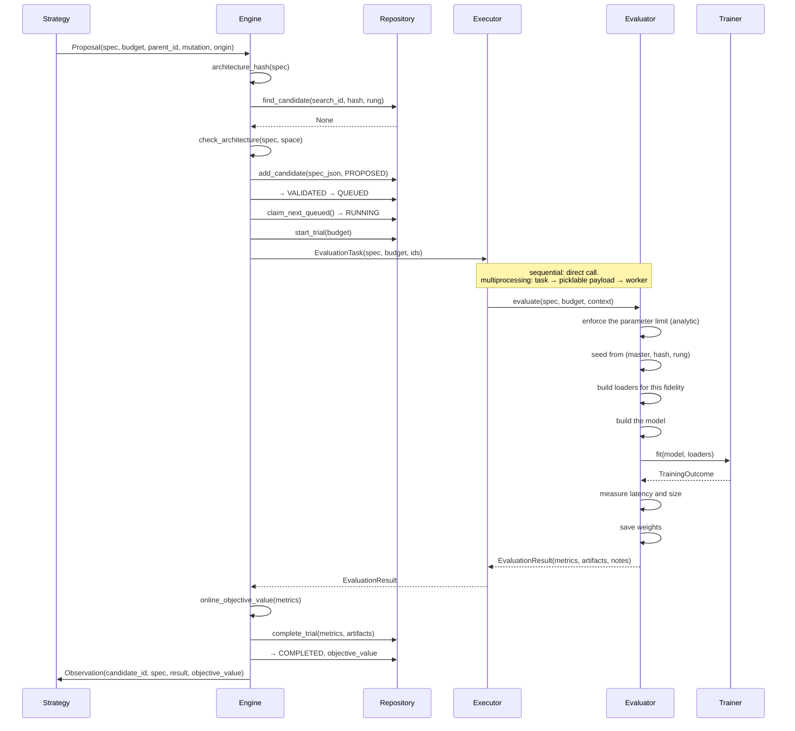
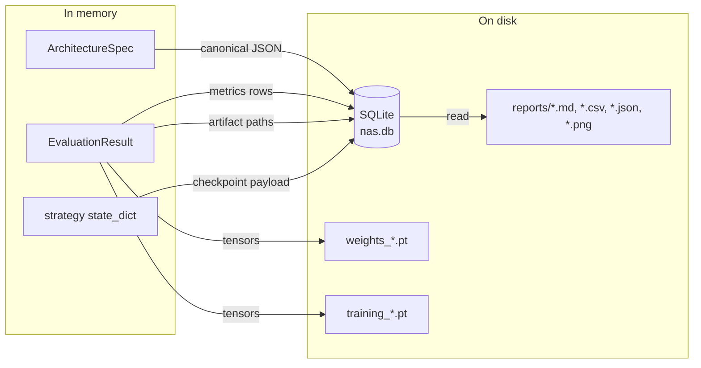
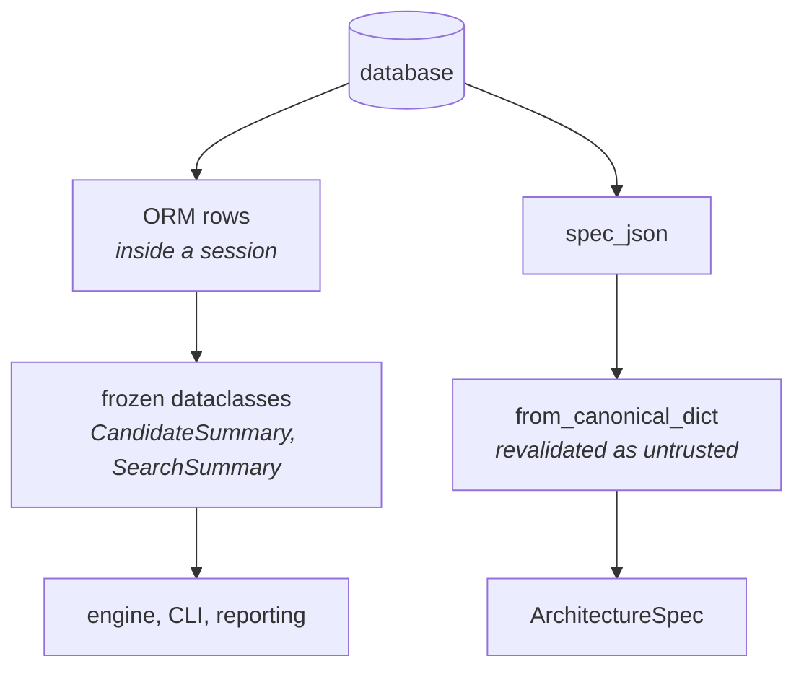
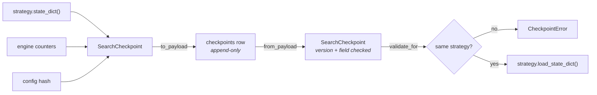
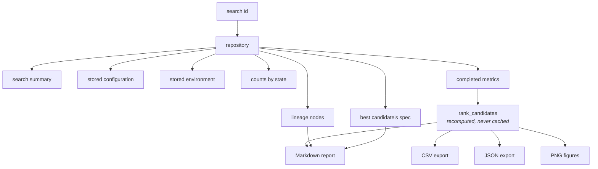

# Data flow

What moves between components, in what form, and where each boundary validates.

## The principle

Data crossing a boundary is either **already validated** or **treated as untrusted**. There
is no third category, and no component performs a defensive check on something a boundary
has already guaranteed.



## Configuration in



Merging is **deep**: setting `NAS_ENGINE__TRAINING__OPTIMIZER__LEARNING_RATE` replaces
exactly that leaf and leaves the rest of the training section alone. A shallow merge would
silently discard every sibling field — a classic source of "my configuration file stopped
working when I set one environment variable".

Lists are **replaced**, not concatenated: "append to the list in the file" is almost never
what an override means, and concatenation cannot be undone.

At the boundary, `build_*` methods convert Pydantic models into plain dataclasses
(`TrainingSettings`, `LoaderSettings`, `EvaluationSettings`, `TrainingBudget`,
`ObjectiveSet`, `ConstraintSet`). The domain never sees a Pydantic model — which is why
`training` is usable from a plain script.

## An architecture through the system



The genotype is the *only* thing that crosses a process boundary. A `nn.Module` never does:
it is rebuilt from the specification in each worker.

## One evaluation, end to end



## Payload shapes

### Engine → executor → worker

`EvaluationTask` is a dataclass holding live objects. Crossing a process boundary, it
becomes plain data:

```python
{
    "config":  {...},        # the full serialised SearchConfig
    "spec":    {...},        # canonical architecture JSON
    "budget":  {"epochs": 3, "train_fraction": 1.0, "resolution": null, "rung": 0},
    "candidate_id": "…", "trial_id": "…", "architecture_hash": "…",
    "attempt": 0, "seed": 42, "worker_id": "0",
}
```

Nothing custom needs to be picklable. The worker validates the configuration and the
architecture on arrival, exactly as if they had come from a file — because from the
worker's point of view, they did.

### Worker → engine

```python
{
    "candidate_id": "…", "architecture_hash": "…",
    "budget": {...},
    "metrics": {"validation_accuracy": 0.66, "trainable_parameters": 112650.0, …},
    "succeeded": true,
    "failure": null,
    "artifacts": {"weights": "385cfb98…/weights_e3_f1_rnative_rung0.pt"},
    "artifact_bytes": {"weights": 451328},
    "started_at": "2026-07-27T…", "completed_at": "2026-07-27T…",
    "duration_seconds": 4.12, "device": "cpu", "worker_id": "0",
    "training": {...},
    "notes": ["Latency is hardware-, thread-, and load-dependent. …"],
}
```

A failure comes back in the same shape with `succeeded: false` and a populated `failure`
block. **No exception ever crosses the boundary** — it would lose its traceback and can
fail to unpickle.

### Metrics

A flat `dict[str, float]`. Flat because objectives reference metrics by name and a nested
structure would need a path language; floats because they are ranked, compared, and stored
in an indexed column.

The names are a contract between the evaluator and the objective configuration.
[Training and evaluation](../concepts/training-and-evaluation.md#part-3-what-the-evaluator-measures)
lists them.

## Storage



**The database holds paths, never bytes.** A database with 50 MB weight blobs is slow to
query, slow to back up, and awkward to inspect; the filesystem is the right store for large
binaries. Paths are stored *relative to the artifact root*, so a run directory can be moved
or archived without rewriting the database.

## Reading back



Two rules on the read path:

**Never return an ORM instance.** They are bound to the session that loaded them; touching
a lazily-loaded attribute after the session closes raises `DetachedInstanceError` at a call
site far from the cause.

**Revalidate stored JSON.** A hand-edited or corrupted row produces a clear validation
error rather than a half-built object:

```python
def get_candidate_spec(self, candidate_id: str) -> ArchitectureSpec:
    ...
    return from_canonical_dict(record.spec_json)   # full Pydantic validation
```

## Checkpoint round-trip



Checkpoints are **append-only**. Overwriting a single row would mean a crash during the
write leaves no usable checkpoint at all; keeping the history means the previous one is
always available. `prune_checkpoints` keeps the most recent few, because strategy state
includes the population and every seen hash and therefore grows with the search.

## Report generation



The ranking is **always recomputed** from persisted metrics, never cached. A cached front
goes stale the moment another candidate completes, and a stale front is worse than a slow
one. It is also why a report can be regenerated with different objective weights without
re-running anything.

## Where each boundary validates

| Boundary | Input | Validation | On failure |
| --- | --- | --- | --- |
| YAML → config | Untrusted file | `yaml.safe_load` + Pydantic, `extra="forbid"` | `ConfigurationError` naming every field |
| Environment → config | Untrusted strings | `yaml.safe_load` per value + Pydantic | `ConfigurationError` |
| CLI → config | Untrusted strings | Same | `ConfigurationError` |
| Strategy → engine | Trusted (in-process) | Structural validation anyway, because a strategy may be third-party | `FAILED` or `PRUNED` |
| Engine → executor | Trusted | None | — |
| Executor → worker | Crosses a process | Full revalidation on arrival | Failed result |
| Database → domain | Untrusted (may be hand-edited) | Full Pydantic revalidation | `ArchitectureValidationError` |
| Checkpoint file → domain | Untrusted | Version check, field check, `weights_only=True` | `CheckpointError` |
| Imported architecture JSON | Untrusted | Size cap + full validation | `ArchitectureValidationError` |

## Idempotency

Operations that may be repeated after a crash are idempotent:

| Operation                               | Repeated behaviour                                                    |
| --------------------------------------- | --------------------------------------------------------------------- |
| `add_candidate`                         | Unique constraint → `DuplicateRecordError`, translated to "duplicate" |
| `complete_trial` with the same artifact | The artifact row is *updated*, not inserted again                     |
| `save_checkpoint`                       | Appends a new sequence number                                         |
| `ensure_schema`                         | No-op when already current                                            |
| `ensure_directory`                      | No-op when it exists                                                  |
| Report generation                       | Overwrites the same deterministic filenames                           |

The artifact case was a real bug found by the failure-recovery tests: a resumed evaluation
rewrites the same weights file, and a second insert violated the uniqueness constraint,
aborting the transaction and **losing the metrics alongside it**.

## See also

- [System overview](system-overview.md) — the lifecycle these flows implement.
- [Persistence](persistence.md) — the schema.
- [Security](security.md) — why untrusted input is treated as untrusted.
