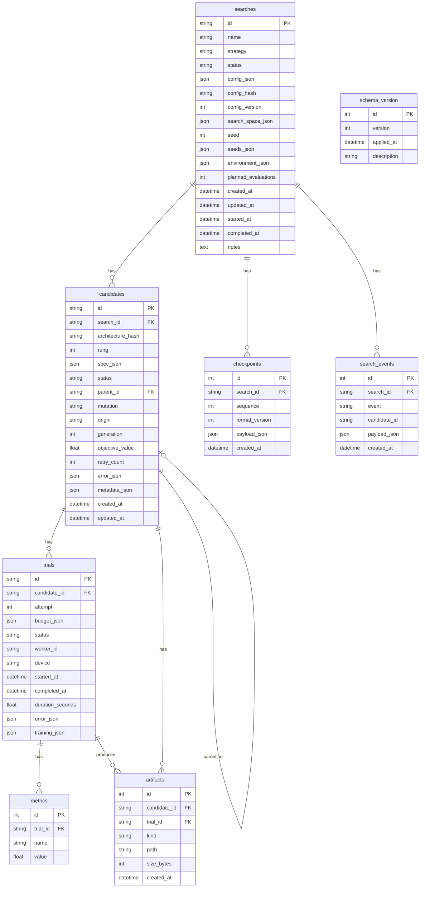

# Persistence

The data model, the repository seam, transactions, and schema evolution.

## Why persist at all

A search that keeps everything in memory loses everything when the process dies — and a NAS
run is long enough that it will die at least once. Persistence gives four things:

1. **Resume.** An interrupted search continues rather than restarting.
2. **Inspection.** `nas-engine status` works while a search is running.
3. **Reporting after the fact.** A report can be produced weeks later, from a copied
   database, on a different machine.
4. **Reproducibility evidence.** The configuration, the seed, and the environment that
   produced a result are stored *with* the result.

## Why SQLite

| Requirement                      | SQLite  | PostgreSQL | JSON files     |
| -------------------------------- | ------- | ---------- | -------------- |
| Zero operational overhead        | ✅      | ❌ server  | ✅             |
| Transactional                    | ✅      | ✅         | ❌             |
| Queryable                        | ✅ SQL  | ✅ SQL     | ❌ hand-rolled |
| Concurrent readers while writing | ✅ WAL  | ✅         | ❌             |
| Concurrent writers               | limited | ✅         | ❌             |
| Copyable as one file             | ✅      | ❌         | awkward        |

A local NAS run needs durable, queryable storage with no server to install. SQLite is
exactly that. Its limitation — one writer at a time — is not a problem here: the engine's
write rate is a handful of transactions per *evaluation*, and evaluations take seconds to
minutes.

SQLAlchemy sits on top so the schema can be described declaratively and the same code could
target PostgreSQL if a distributed deployment ever needed it. See
[ADR 0002](../adr/0002-persistence-layer.md).

## The schema



### Key constraints

| Constraint                                    | Table         | Purpose                                                                       |
| --------------------------------------------- | ------------- | ----------------------------------------------------------------------------- |
| `(search_id, architecture_hash, rung)` unique | `candidates`  | Duplicate detection, enforced by the database rather than by a prior `SELECT` |
| `(candidate_id, attempt)` unique              | `trials`      | An attempt number cannot be reused                                            |
| `(trial_id, name)` unique                     | `metrics`     | One value per metric per trial                                                |
| `(candidate_id, kind, path)` unique           | `artifacts`   | Idempotent artifact recording                                                 |
| `(search_id, sequence)` unique                | `checkpoints` | Append-only ordering                                                          |

### Design decisions

**String primary keys.** Auto-increment integers are assigned by the database, so a worker
cannot know a record's id until it has committed — awkward for logging and impossible for
artifact paths chosen before the write. UUID hex ids are generated in the process, so an id
exists before the row does.

**Timezone-aware timestamps everywhere.** SQLite has no native timestamp type and discards
timezone information, so a `UTCDateTime` type decorator re-attaches UTC on read. Naive
datetimes compare incorrectly across processes and are ambiguous once exported.

**JSON for structured payloads, a table for metrics.** Architecture specifications, budgets,
and error details are nested documents whose schema belongs to the application; JSON keeps
the relational schema stable while the domain evolves. Metrics are different — they *are*
queried, aggregated, and ranked by the database — so one row per `(trial, name)` keeps
`SELECT … ORDER BY value` a plain index scan.

**Paths, not bytes.** A database holding 50 MB weight blobs is slow to query, slow to back
up, and awkward to inspect. Paths are stored relative to the artifact root, so a run
directory can be moved or archived without rewriting anything.

**Cascade deletes.** Deleting a search removes its candidates, trials, metrics, artifact
records, checkpoints, and events. Without cascades a deleted search leaves orphan rows that
corrupt every aggregate query.

## SQLite configuration

Four pragmas, set on every connection, each earning its place:

| Pragma | Value | Why |
| --- | --- | --- |
| `journal_mode` | `WAL` | Readers proceed while a writer holds the lock. Without it, the CLI cannot inspect a search while that search is running |
| `foreign_keys` | `ON` | SQLite ignores foreign keys unless enabled, **per connection**. Without this, the ORM's cascade deletes silently do nothing |
| `busy_timeout` | 30 000 ms | With multiprocessing workers, write-lock contention is normal. Without a timeout SQLite raises `database is locked` immediately |
| `synchronous` | `NORMAL` | Under WAL this is durable against application crashes — the failure mode that actually happens — while avoiding an fsync per transaction |

That `foreign_keys` default is the one that catches people. It is off by default in SQLite,
per connection, and nothing warns you.

## The repository pattern

Without one, `session.query(...)` spreads across the engine, the CLI, and the report
generator. Three consequences follow, all bad: the schema can no longer change without
touching unrelated modules; testing any of them requires a database; and transaction
boundaries end up implicit and inconsistent.

`SearchRepository` confines persistence to a single seam. Everything above it speaks in
domain objects and never sees a `Session`.

### Detached read models

Every query returns a frozen dataclass:

```python
@dataclass(frozen=True)
class CandidateSummary:
    id: str
    architecture_hash: str
    status: str
    metrics: dict[str, float]
    artifacts: dict[str, str]
    ...
```

ORM instances are bound to the session that loaded them; touching a lazily-loaded attribute
after the session closes raises `DetachedInstanceError` at a call site far from the cause.
Returning plain data makes that failure impossible and keeps SQLAlchemy types out of the
domain.

### One method, one transaction

```python
@contextmanager
def session(self) -> Iterator[Session]:
    session = self._session_factory()
    try:
        yield session
        session.commit()
    except SQLAlchemyError as exc:
        session.rollback()
        raise PersistenceError(...) from exc
    except Exception:
        session.rollback()
        raise
    finally:
        session.close()
```

A method either fully applies or fully rolls back. Multi-step operations that must be
atomic are single methods for exactly that reason:

- `complete_trial` writes the trial status, every metric row, and every artifact row in one
  transaction. A trial marked completed but missing its metrics would be
  indistinguishable from a trial that measured nothing.
- `claim_next_queued` selects and updates in one transaction. SQLite serialises writers, so
  exactly one worker can win the claim; the loser sees the row already in `RUNNING` and
  moves on. **This is what prevents two workers from training the same architecture.**

### Duplicate handling under concurrency

Checking then inserting is a race — two workers can both see "not present" and both insert.
The unique constraint is the authority:

```python
try:
    with self._database.session() as session:
        session.add(CandidateRecord(...))
except PersistenceError as exc:
    if isinstance(exc.__cause__, IntegrityError):
        raise DuplicateRecordError(...) from exc
    raise
```

The engine treats `DuplicateRecordError` as "lost an insert race" and moves on, which is
correct behaviour rather than an error.

### No SQL by string interpolation

Every query goes through SQLAlchemy's expression language, which parameterises values. A
hostile architecture hash or search name cannot alter a statement. See
[security](security.md#5-sql-injection).

## Schema evolution

`Base.metadata.create_all` creates tables that do not exist. It does **not** alter tables
that do. A user who upgrades the package and opens last month's database gets a schema
missing the new column and a stack trace from deep inside SQLAlchemy.

So there is a migration list. Each entry has a version, a description, and an upgrade
function. On connect, the applied version is compared to the target:

| Comparison      | Action                                                        |
| --------------- | ------------------------------------------------------------- |
| Equal           | Nothing to do                                                 |
| Database lower  | Apply the missing migrations in order, record the new version |
| Database higher | **Refuse**, with an error saying so                           |

That last case matters: silently downgrading would corrupt data.

```text
the database is at schema version 3 but this build of nas-engine supports at most
version 2. Upgrade nas-engine, or point at a different database file. Downgrading a
schema is not supported and would lose data.
```

### Adding a migration

1. Change the ORM models.
2. Append a `Migration` to `MIGRATIONS` with the next version number and an upgrade
   function issuing the `ALTER TABLE` statements.
3. **Never edit a released migration.** Databases in the field have already applied it and
   would silently diverge.
4. Add a test that a version-*N* database migrates to *N+1* with its data intact.

### Why not Alembic

Alembic is the right answer for a service with a long-lived production database and a team.
Here it adds a dependency, a config file, a versions directory, and an autogenerate
workflow, in exchange for handling a migration cadence this project does not have. The
version table maps onto Alembic's `alembic_version` directly, so adopting it later is a
small change. Recorded in [ADR 0002](../adr/0002-persistence-layer.md).

## Repository operations

| Category    | Method                       | What it does                                         |
| ----------- | ---------------------------- | ---------------------------------------------------- |
| Searches    | `create_search`              | Insert a run with its config, seeds, and environment |
| Searches    | `get_search`                 | Fetch one run's summary                              |
| Searches    | `get_search_config`          | Read back the stored configuration                   |
| Searches    | `get_search_environment`     | Read back the environment snapshot                   |
| Searches    | `list_searches`              | List runs, newest first                              |
| Searches    | `find_latest_search`         | Resolve the run `resume` should continue             |
| Searches    | `update_search_status`       | Move a run's status and stamp its timestamps         |
| Searches    | `delete_search`              | Delete a run and everything it owns, by cascade      |
| Candidates  | `add_candidate`              | Insert a proposal, enforcing identity uniqueness     |
| Candidates  | `get_candidate`              | Fetch one candidate                                  |
| Candidates  | `get_candidate_spec`         | Re-validate and return the stored architecture       |
| Candidates  | `find_candidate`             | Look up by architecture hash and rung                |
| Candidates  | `list_candidates`            | Filter and paginate                                  |
| Candidates  | `count_candidates_by_status` | The counts `nas-engine status` prints                |
| Candidates  | `update_candidate_state`     | Apply a validated state transition                   |
| Candidates  | `increment_retry`            | Bump the retry counter                               |
| Candidates  | `claim_next_queued`          | Atomically take one queued candidate for a worker    |
| Candidates  | `seen_hashes`                | Every architecture hash a run has proposed           |
| Trials      | `start_trial`                | Open an attempt                                      |
| Trials      | `complete_trial`             | Record metrics, artifacts, and state in one commit   |
| Trials      | `fail_trial`                 | Record a structured failure                          |
| Trials      | `list_trials`                | Every attempt for a candidate, oldest first          |
| Artifacts   | `record_artifact`            | Insert or update an artifact row                     |
| Checkpoints | `save_checkpoint`            | Append a search checkpoint                           |
| Checkpoints | `latest_checkpoint`          | The most recent checkpoint, or `None`                |
| Checkpoints | `count_checkpoints`          | How many are retained                                |
| Checkpoints | `prune_checkpoints`          | Drop all but the newest *n*                          |
| Events      | `record_event`               | Append an audit event                                |
| Events      | `list_events`                | A run's events, oldest first                         |
| Aggregation | `completed_metrics`          | The population that ranking consumes                 |
| Aggregation | `best_candidate`             | Top candidate by a single metric                     |
| Aggregation | `lineage_nodes`              | The parent-child graph                               |
| Recovery    | `recover_interrupted`        | Requeue or fail candidates left mid-evaluation       |

### `best_candidate` versus `rank_candidates`

`best_candidate` is a *single-metric* query: fast, simple, `ORDER BY` on one column.
Multi-objective selection goes through
[`rank_candidates`](../../src/nas_engine/objectives/ranking.py), which needs the whole
population — Pareto fronts and population-relative normalisation cannot be expressed as one
SQL `ORDER BY`.

### `recover_interrupted`

The recovery sweep, run before a resume proposes anything new:

```python
for candidate in candidates_in_RUNNING:
    for trial in candidate.trials:
        if trial.status == RUNNING:
            trial.status = INTERRUPTED
            trial.error_json = {"code": "interrupted", "message": "…"}
    if candidate.retry_count < max_retries:
        candidate.status = QUEUED
        candidate.retry_count += 1
    else:
        candidate.status = FAILED
        candidate.error_json = {"code": "retry_exhausted_error", …}
```

It returns a `RecoveryReport` that the engine turns into a user-visible warning.

## Querying directly

The database is a plain SQLite file. Nothing stops you:

```bash
sqlite3 artifacts/random_search/nas.db
```

```sql
-- the leaderboard
SELECT c.architecture_hash, m.value AS accuracy
FROM candidates c
JOIN trials t   ON t.candidate_id = c.id AND t.status = 'completed'
JOIN metrics m  ON m.trial_id = t.id AND m.name = 'validation_accuracy'
WHERE c.search_id = '…' AND c.status = 'completed'
ORDER BY accuracy DESC
LIMIT 10;

-- why candidates failed
SELECT json_extract(error_json, '$.code') AS code, COUNT(*)
FROM candidates WHERE search_id = '…' AND status = 'failed'
GROUP BY code;

-- time spent per rung
SELECT json_extract(budget_json, '$.rung') AS rung,
       COUNT(*) AS trials, ROUND(SUM(duration_seconds), 1) AS seconds
FROM trials GROUP BY rung;
```

For anything the engine will also write to, prefer the repository — direct writes bypass
state-transition validation.

## Performance

Measured on a modest laptop CPU (`scripts/benchmark.py`):

| Operation                       | Typical                        |
| ------------------------------- | ------------------------------ |
| Insert one candidate            | ~5 ms                          |
| List 30 candidates with metrics | ~15 ms                         |
| Count by status                 | <1 ms (one indexed `GROUP BY`) |
| Save a checkpoint               | ~5 ms                          |

Against evaluations that take seconds to minutes, persistence is not the bottleneck. The
guards in [`tests/performance`](../../tests/performance/test_performance_guards.py) exist to
catch a regression that changes that — an index disappearing, or a query becoming a Python
loop.

## See also

- [ADR 0002](../adr/0002-persistence-layer.md) — the decision and its alternatives.
- [Backup and recovery](../operations/backup-and-recovery.md) — operating the database.
- [Data flow](data-flow.md) — what is stored and when.
