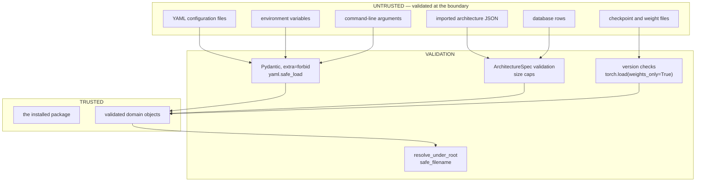

# Security review

The trust boundary, the threat model, and every mitigation — with the residual risks named.

## The trust boundary



**Trusted:** the installed package and its dependencies.

**Untrusted:** everything that arrives at runtime — configuration files, environment
variables, command-line arguments, imported architecture JSON, database rows (which may
have been hand-edited), and checkpoint files.

The threat model assumes an attacker can supply a configuration file, an architecture JSON
document, or a checkpoint, and cannot modify the installed code. That covers the realistic
cases: a shared configuration repository, an architecture published by a colleague, a
database restored from a backup of uncertain provenance.

---

## 1. Unsafe deserialisation

**The risk.** `pickle` executes arbitrary code during deserialisation. `torch.load` uses
`pickle` by default, so loading a crafted `.pt` file is remote code execution.
`yaml.load` with the default loader instantiates arbitrary Python objects named by
`!!python/object` tags.

**Mitigations.**

```python
# every torch.load call in the project
payload = torch.load(path, map_location="cpu", weights_only=True)

# every YAML parse
loaded = yaml.safe_load(text)
```

`weights_only=True` restricts the loader to tensors and plain data — which is all these
formats contain, so nothing is lost. `safe_load` refuses `!!python/...` tags entirely.

Only `state_dict`s are ever saved, never module objects. Pickling a module records its class
path, making the file unloadable after any refactor *and* unsafe to load from an untrusted
source.

**Tested.** `test_python_object_tags_are_refused` writes a YAML file containing
`!!python/object/apply:os.system ['echo pwned']` and asserts it is rejected.

**Residual risk.** `weights_only=True` is a PyTorch guarantee, not this project's. A
vulnerability in that code path would affect this project too.

---

## 2. Path traversal

**The risk.** Artifact filenames derive partly from configuration and architecture hashes.
A crafted value such as `../../etc/cron.d/payload` would escape the artifact root.

**Mitigations.** Every write routes through
[`resolve_under_root`](../../src/nas_engine/utilities/paths.py):

```python
def resolve_under_root(root: Path, *parts: str | os.PathLike[str]) -> Path:
    for part in parts:
        if Path(os.fspath(part)).is_absolute():
            raise UnsafePathError(...)          # Path("/a") / "/etc/passwd" == "/etc/passwd"
    candidate = root.joinpath(*parts)
    if not is_within(candidate, root):          # resolves symlinks and `..`
        raise UnsafePathError(...)
    return candidate.resolve()
```

`safe_filename` reduces arbitrary text to `[A-Za-z0-9._-]`, strips leading dots so the
result is never hidden or a traversal component, caps the length below the 255-byte
filesystem limit, and avoids Windows reserved names.

Absolute components are **rejected** rather than joined, because
`Path("/a") / "/etc/passwd"` evaluates to `/etc/passwd` in Python and that behaviour has
produced real vulnerabilities.

**Tested.** `TestSafeFilename` and `TestPathValidation` in
[`tests/unit/test_utilities.py`](../../tests/unit/test_utilities.py) cover `../../etc/passwd`,
absolute components, symlink escapes, and sibling directories.

---

## 3. Arbitrary configuration injection

**The risk.** A configuration format that can name a Python object to import, or a callable
to evaluate, is a code-execution vector.

**Mitigations.** No configuration field names a Python object. Strategies and dataset
providers are selected by **name from a registry**, and registration is an explicit Python
call the user makes in their own process:

```python
factory = _REGISTRY.get(name)          # a lookup, never an import
if factory is None:
    raise ConfigurationError(f"unknown search strategy '{name}'; registered are …")
```

There is deliberately no plugin auto-discovery. Importing a module named in an untrusted
configuration file *is* arbitrary code execution, however convenient it would be.

`extra="forbid"` on every model means an unknown key is an error, so a crafted file cannot
smuggle fields past validation.

**Residual risk.** A user who calls `register_strategy` with attacker-supplied code has
already lost. That is outside the boundary.

---

## 4. `eval` and `exec`

**Not used anywhere.** No `eval`, no `exec`, no `compile`, no `__import__` on a runtime
string. Verifiable:

```bash
grep -rnE '\b(eval|exec|compile)\s*\(' src/nas_engine/
```

The only dynamic behaviour is registry lookup by name, which cannot construct new code.

---

## 5. SQL injection

**The risk.** String-interpolated SQL with attacker-controlled values.

**Mitigation.** No SQL is built by string interpolation anywhere. Every query goes through
SQLAlchemy's expression language, which parameterises values:

```python
session.scalars(
    select(CandidateRecord).where(
        CandidateRecord.search_id == search_id,
        CandidateRecord.architecture_hash == architecture_hash,
    )
).one_or_none()
```

A hostile hash or search name is bound as a parameter and cannot alter the statement.

The only raw SQL is the fixed pragma strings in `_configure_sqlite`, which contain no
user-controlled data — the busy timeout is coerced with `int()` before interpolation.

---

## 6. Command injection

**The risk.** Passing user data to a shell.

**Mitigation.** Exactly one subprocess call exists, in `_git_commit`:

```python
subprocess.run(
    ["git", "rev-parse", "HEAD"],   # fixed argv, never a shell string
    capture_output=True, check=False, text=True, timeout=5.0,
)
```

Fixed argument list, no `shell=True`, no user-controlled text, a timeout, and failures
swallowed because running outside a git checkout is entirely normal.

---

## 7. Unbounded resource consumption

**The risk.** A crafted configuration or architecture that exhausts memory, disk, or time.

**Mitigations.**

| Vector                              | Bound                                                                    |
| ----------------------------------- | ------------------------------------------------------------------------ |
| Oversized configuration file        | `MAX_CONFIG_BYTES` = 1 MiB, checked before parsing                       |
| Oversized architecture JSON         | `MAX_ARCHITECTURE_JSON_BYTES` = 1 MiB                                    |
| Oversized JSON generally            | `DEFAULT_MAX_JSON_BYTES` = 16 MiB                                        |
| Enormous architectures              | `constraints.max_parameters`, checked **analytically** before allocation |
| Enormous compute                    | `constraints.max_multiply_accumulates`                                   |
| Runaway training                    | `budget.max_seconds_per_evaluation`, checked every 20 steps              |
| Runaway search                      | `budget.max_seconds`, `budget.max_evaluations`                           |
| Runaway retries                     | `retry.max_retries`, bounded and counted                                 |
| Unbounded checkpoint growth         | `persistence.keep_checkpoints` prunes                                    |
| Deep recursion in log redaction     | `max_depth`                                                              |
| Deep recursion in lineage traversal | `max_depth` plus cycle detection                                         |
| Structural limits                   | ≤ 8 stages, ≤ 16 blocks per stage, ≤ 4096 channels, ≤ 1024 input size    |

The parameter ceiling is checked **before** the model is built, from the analytic cost
model. A candidate with a hundred million parameters is rejected in microseconds rather
than by an out-of-memory kill.

**Tested.** `test_parameter_limit_prunes_before_building`,
`test_oversized_file_is_refused`, `test_rejects_oversized_payload`,
`test_timeout_is_enforced`, `test_recursion_is_bounded`, `test_cycles_terminate`.

---

## 8. Malformed architecture specifications

**The risk.** A crafted architecture document causing a crash, an infinite loop, or an
enormous allocation.

**Mitigations.** Layered:

1. **Size cap** before parsing.
2. **Schema validation** — closed enums, bounded ranges, `extra="forbid"`.
3. **Semantic validation** — shape inference proves the network is buildable.
4. **Constraint validation** — resource limits.

A malicious `"operation": "__import__('os').system"` fails at step 2 with a clear error,
because operations are a closed enumeration and never a lookup key into anything executable.

**Tested.** `test_rejects_unknown_operations`, `test_rejects_unknown_fields`,
`test_corrupt_specification_is_rejected_on_read`.

---

## 9. Denial of service from oversized search spaces

**The risk.** A configuration defining a space so large or so constrained that sampling
never terminates.

**Mitigations.**

- `SearchSpace` bounds every macro choice: ≤ 8 stages, ≤ 16 blocks per stage.
- `require_non_empty()` rejects an infeasible parameter ceiling **before** the search
  starts.
- The sampler has a hard attempt budget and raises with the rejection reasons rather than
  looping.
- The engine detects a stalled strategy after two idle rounds and stops with
  `SPACE_EXHAUSTED`.

```text
failed to sample a valid architecture in 200 attempts. Most common rejection reasons:
[('constraint:multiply_accumulates', 200)]. Relax the search-space constraints … or widen
the choice sets.
```

---

## 10. Sensitive information in logs

**The risk.** Credentials in configuration reaching logs or reports.

**Mitigations.** A structlog processor walks every event dictionary and replaces the value
of any key whose name matches a sensitive fragment:

```python
SENSITIVE_KEY_FRAGMENTS = ("api_key", "apikey", "auth", "credential", "passwd",
                           "password", "private_key", "secret", "token")
```

Matching is case-insensitive and substring-based, so `HF_API_TOKEN` and `db_password` are
both caught. Nested mappings and sequences are traversed, with a depth cap.

Environment capture uses an **allow-list**, not a deny-list: only six variables that
materially affect numerical results are recorded, and none carries credentials.

**Tested.** `TestRedaction` covers seven key patterns, nesting, sequences, depth bounding,
and non-mutation of the input. `test_only_allow_listed_variables_are_captured` sets a fake
`MY_SECRET_TOKEN` and asserts it is absent.

**Residual risk.** A credential in a value whose *key* looks innocuous — `{"note": "the
password is hunter2"}` — is not caught. Nothing short of content scanning would catch it,
and content scanning has its own false positives.

---

## 11. File permission assumptions

**The risk.** Assuming a directory is writable, or creating world-readable files containing
sensitive results.

**Mitigations.** `ensure_directory` verifies writability with `os.access(path, os.W_OK)`
and raises an actionable error rather than failing at the first write:

```text
directory /var/lib/nas is not writable by the current user; adjust permissions or choose
a different output directory
```

`nas-engine doctor` checks the output, artifact, and report directories before a search
starts.

**Deliberate non-mitigation.** The project does **not** set restrictive umasks or file
modes. Doing so would surprise users whose workflow depends on group access, and search
results are not secret by nature. If they are in your context, set the umask at the process
level.

The container runs as **uid 1000, not root**: a container escape then starts unprivileged,
and files written to a mounted volume are not owned by root on the host.

---

## 12. Dependency pinning and supply chain

**Current state.** `pyproject.toml` specifies lower bounds (`torch>=2.1`), not exact pins.
That is right for a **library** — pinning exact versions in a library causes unresolvable
conflicts for anyone depending on it.

**For a deployment, pin.** Generate a lock file and install from it:

```bash
pip install pip-tools
pip-compile pyproject.toml --output-file requirements.lock
pip install --require-hashes -r requirements.lock
```

`--require-hashes` verifies artefact integrity, which is the part that actually defends
against a compromised index.

CI pins the base image by tag; for stronger guarantees, pin by digest
(`python@sha256:...`).

**Residual risk.** This project has ten direct dependencies and a much larger transitive
closure through PyTorch. A compromise anywhere in it is a compromise here. Hash-pinned
installs and dependency scanning are the mitigations, and both belong in the deployment
rather than in the library.

---

## 13. Artifact integrity

**Current state.** Artifact *paths* and *sizes* are recorded; content hashes are not.

**What this catches.** A missing file is detected and reported clearly:

```text
the weights file for candidate a1b2c3 is missing from disk: …/weights_e3.pt. The database
record survived but the artifact did not.
```

Loading also verifies that the checkpoint's recorded architecture hash matches the
architecture being loaded into, so a mismatched or swapped file is rejected before it can
produce confusing shape errors.

**What this does not catch.** Silent modification of an artifact's *contents*.

**Why not.** Hashing every weights file costs time proportional to model size on every
write and every read, for a threat — an attacker with write access to the artifact
directory — who could equally modify the database. If artifact integrity matters in your
context, hash on write and verify on read; the `artifacts` table already has a column that
could hold the digest.

---

## What is deliberately out of scope

| Not addressed                    | Why                                                             |
| -------------------------------- | --------------------------------------------------------------- |
| Authentication and authorisation | No network service; access control is filesystem access control |
| Transport encryption             | Nothing crosses a network                                       |
| Multi-tenancy isolation          | Single-user tool; one search per output directory               |
| Secrets management               | Nothing here needs a secret                                     |
| Audit logging for compliance     | `search_events` records the lifecycle, not access               |
| Sandboxing evaluation            | Architectures are data, not code; they cannot execute anything  |

That last row is worth emphasising: **a search space cannot express arbitrary computation.**
An architecture is a closed set of enum values and bounded integers. There is no code
generation and no dynamic import, so a malicious architecture can at worst be expensive —
which the resource limits bound.

---

## Verification

| Control                | Verified by                                                               |
| ---------------------- | ------------------------------------------------------------------------- |
| No unsafe YAML         | `test_python_object_tags_are_refused`                                     |
| No unsafe torch.load   | Every call site uses `weights_only=True`; grep-verifiable                 |
| Path traversal blocked | `TestPathValidation`, `TestSafeFilename`                                  |
| Filename sanitisation  | `test_reduces_hostile_input` (parametrised over seven hostile inputs)     |
| Size caps              | `test_oversized_file_is_refused`, `test_rejects_oversized_payload`        |
| No SQL interpolation   | Code review; SQLAlchemy expression language throughout                    |
| No `eval`/`exec`       | `ruff` rule `S` (flake8-bandit) enabled project-wide                      |
| Log redaction          | `TestRedaction`                                                           |
| Environment allow-list | `test_only_allow_listed_variables_are_captured`                           |
| Resource limits        | `test_parameter_limit_prunes_before_building`, `test_timeout_is_enforced` |
| Recursion bounds       | `test_recursion_is_bounded`, `test_cycles_terminate`                      |
| Container non-root     | `nightly.yml` asserts the container user is not root                      |

`ruff`'s `S` rule set (flake8-bandit) runs on every commit and every CI build. The three
suppressions in the codebase are individually justified at their call sites: the
fixed-argv subprocess call, and two reproducible-not-cryptographic uses of `random.Random`.

## Reporting a vulnerability

Open a private security advisory on the repository rather than a public issue.
