# System overview

How the pieces fit together.

## The shape of the system

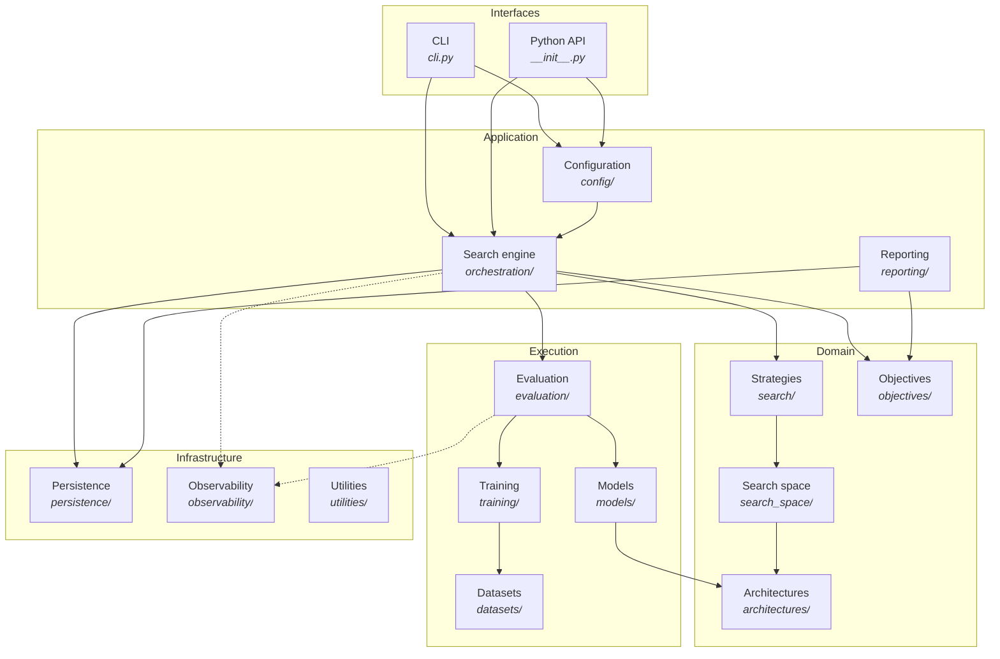

Arrows point from user to used. Nothing in the domain layer knows about the engine, the
database, or the CLI — which is what makes each of them testable in isolation.

## The domain model

Six nouns, and the relationships between them.

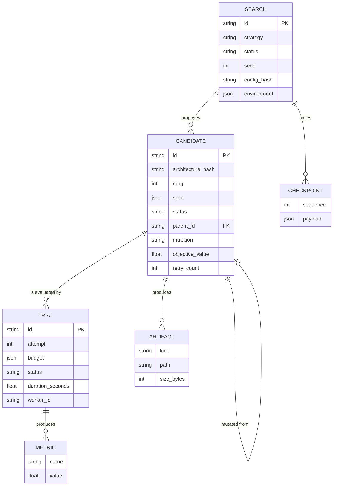

| Concept        | Definition                                                               |
| -------------- | ------------------------------------------------------------------------ |
| **Search**     | One run: a configuration, a seed, a strategy, and everything it produced |
| **Candidate**  | One architecture proposed within a search, at one fidelity rung          |
| **Trial**      | One evaluation attempt for a candidate. Retries create additional trials |
| **Metric**     | One measured scalar from one trial                                       |
| **Artifact**   | A file a trial produced — weights, a training checkpoint                 |
| **Checkpoint** | A snapshot of the strategy's state, so the search can resume             |

A candidate is identified within its search by `(architecture_hash, rung)`. The rung is
part of the key because multi-fidelity search deliberately re-evaluates the same
architecture at a larger budget, and those are genuinely different measurements.

## The search lifecycle

```mermaid
sequenceDiagram
    participant U as User
    participant E as SearchEngine
    participant S as Strategy
    participant R as Repository
    participant X as Executor
    participant V as Evaluator

    U->>E: run()
    E->>R: create_search(config, seed, environment)
    E->>S: propose(free_slots)
    S-->>E: [Proposal, …]

    loop for each proposal
        E->>E: hash → deduplicate → validate
        alt duplicate or invalid
            E->>R: record as DUPLICATE / FAILED / PRUNED
            E->>S: on_duplicate / on_rejected
        else accepted
            E->>R: add_candidate → VALIDATED → QUEUED
        end
    end

    E->>R: claim_next_queued() → RUNNING
    E->>R: start_trial()
    E->>X: run_batch(tasks)
    X->>V: evaluate(spec, budget, context)
    V-->>X: EvaluationResult
    X-->>E: [EvaluationResult, …]

    loop for each result
        alt succeeded
            E->>R: complete_trial(metrics, artifacts)
            E->>R: candidate → COMPLETED
        else retriable failure
            E->>R: fail_trial(error); candidate → QUEUED
        else permanent failure
            E->>R: fail_trial(error); candidate → FAILED
        end
        E->>S: observe(observation)
    end

    E->>R: save_checkpoint(strategy state + engine counters)
    E->>E: check stopping conditions
    E->>R: update_search_status(COMPLETED)
    E-->>U: SearchResult
```

Two things to notice.

**The engine, not the strategy, owns identity.** Hashing, duplicate detection, and
persistence live in the engine. A strategy that had to remember what it had already
proposed across a resume would need its own database, and every new strategy would
reimplement it.

**Failure is data, not control flow.** The evaluator never raises for a candidate-level
problem; it returns a failed result. The engine therefore has exactly one path through the
loop, and a failing candidate cannot abort the search.

## The candidate state machine

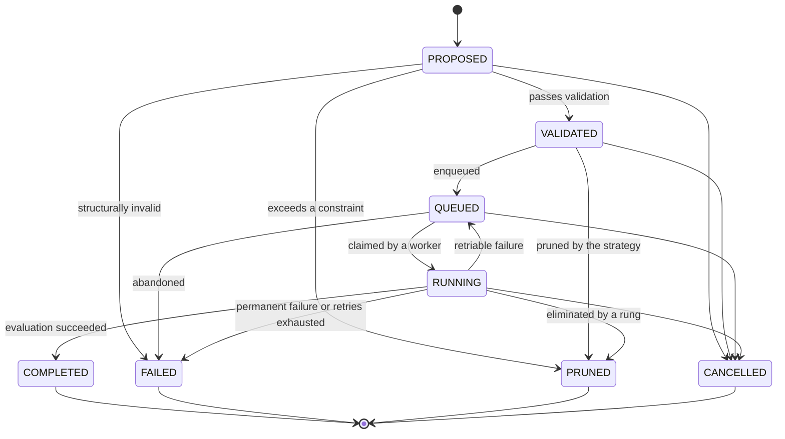

Every transition is validated against a table that lives in exactly one place,
[`orchestration/lifecycle.py`](../../src/nas_engine/orchestration/lifecycle.py), so the
diagram and the code cannot drift apart. A golden fixture pins the table:
changing an edge is a deliberate act, not an accident.

**Why the states are distinct** is the recovery story. When a search is interrupted, the
database is the only record of what happened:

| State found on resume | Interpretation                | Action                                    |
| --------------------- | ----------------------------- | ----------------------------------------- |
| `QUEUED`              | Never started                 | Run it                                    |
| `RUNNING`             | A process died mid-evaluation | Requeue, or fail if retries are exhausted |
| `COMPLETED`           | Finished and recorded         | Leave alone                               |
| `FAILED`              | Permanently failed            | Leave alone                               |
| `PRUNED`              | Rejected by a constraint      | Leave alone                               |

Without distinct states these cases are indistinguishable, and resume either loses work or
repeats it.

`PRUNED` versus `FAILED` matters too: a pruned candidate is one where *nothing went wrong*
— a constraint did its job. Conflating them would make every report look like it had a
failure problem.

## Random-search flow

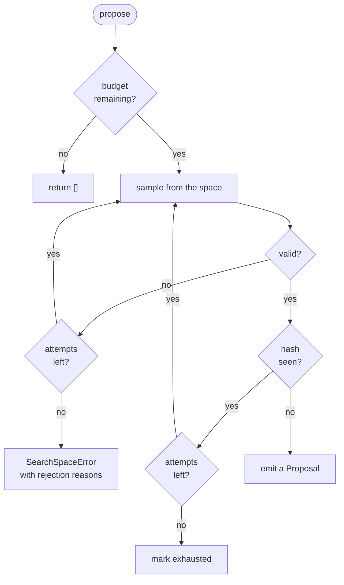

## Evolutionary-search flow

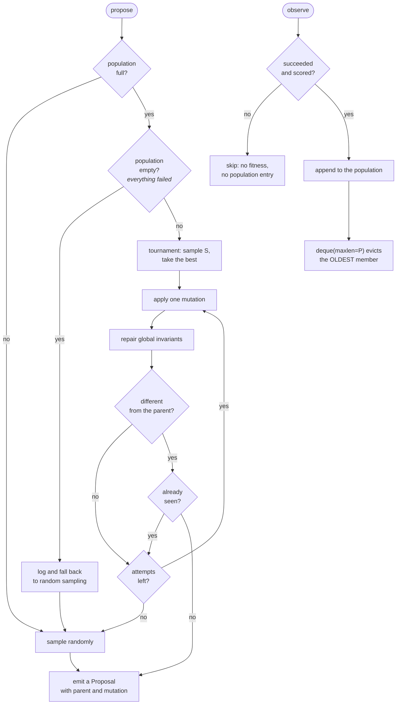

## Successive-halving flow

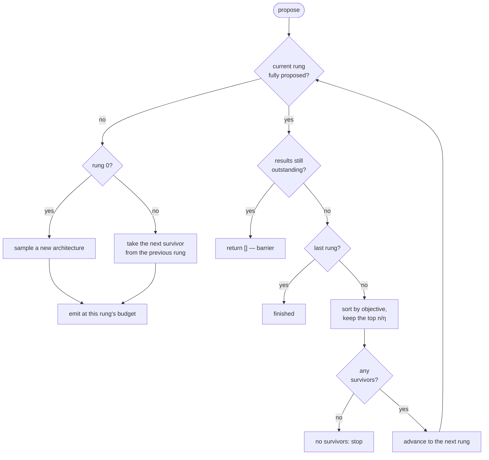

## Training flow

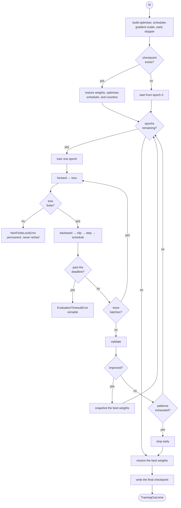

## Persistence flow

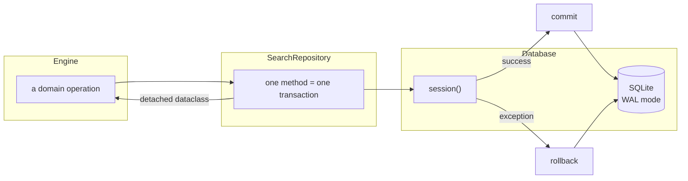

Every repository method runs inside exactly one transaction and returns a frozen dataclass,
never an ORM instance. Multi-step operations that must be atomic — claiming a queued
candidate, recording a completed trial with its metrics and artifacts — are single methods
for exactly that reason.

## Resume and recovery flow

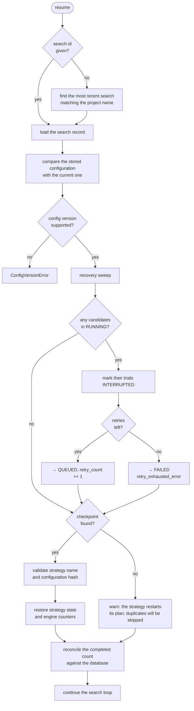

The **reconciliation** step is subtle and necessary. Recovery can *undo* a completion: a
candidate that a crashed process had already finished, but whose result was never
persisted, goes back to the queue. The checkpoint's counter still includes it, so without
reconciliation the engine would believe its budget was spent and would leave the recovered
candidate queued forever — silently returning fewer results than requested. The database is
authoritative because it is what the recovery sweep just updated.

## Module dependency graph

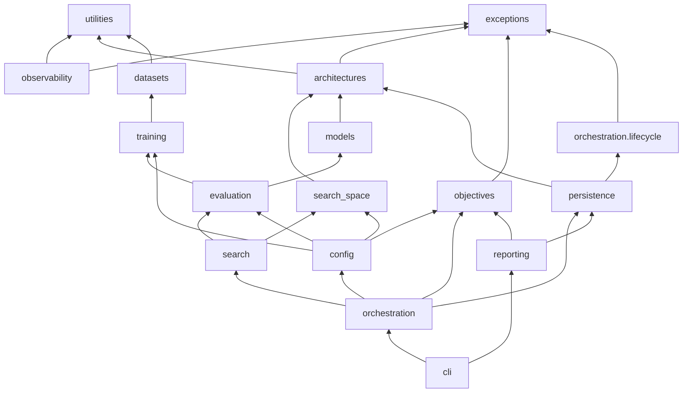

The graph is acyclic. The one place it could have become cyclic is
`persistence → orchestration.lifecycle`: the candidate state machine is a domain concept
that both persistence and the engine need. It lives in a leaf module that imports nothing
but the exception taxonomy, so importing it from persistence creates no cycle.

That property is enforced by a test, not by convention:
`test_the_domain_does_not_import_the_orchestrator` walks the AST of every module in the
leaf packages and fails if any of them imports from a higher layer.

## Execution modes

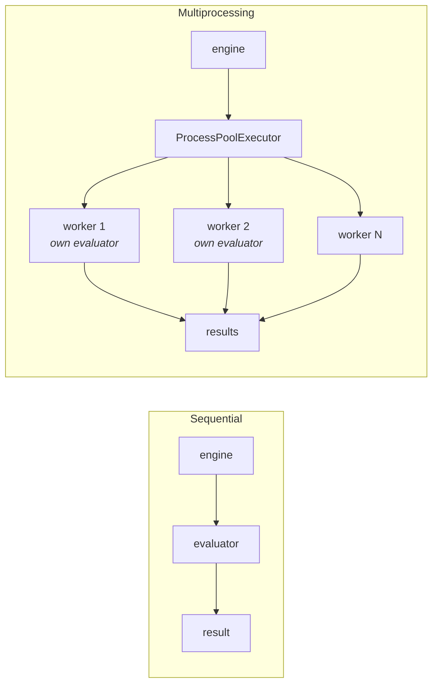

Both satisfy the same `EvaluationExecutor` interface, so the engine's logic is identical
either way and can be tested entirely sequentially. See
[concurrency](concurrency.md) for what parallelism does and does not change.

## Where to go next

| To understand                                           | Read                                    |
| ------------------------------------------------------- | --------------------------------------- |
| Each package's job and the public boundary              | [Component design](component-design.md) |
| What moves between components and where it is validated | [Data flow](data-flow.md)               |
| The database schema and the repository pattern          | [Persistence](persistence.md)           |
| Worker isolation and determinism under parallelism      | [Concurrency](concurrency.md)           |
| The trust boundary and the threat model                 | [Security](security.md)                 |
