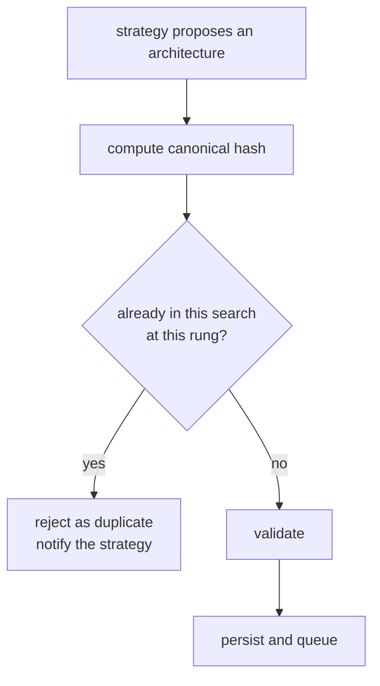

# Architecture encoding

How an architecture is represented, serialised, hashed, and compared — and why every one
of those has to be exactly right.

## Genotype and phenotype

Two representations of the same architecture:

- The **genotype** is the *description*: a small tree of plain data. Which operations,
  which kernel sizes, which widths.
- The **phenotype** is the *network*: a `torch.nn.Module` with allocated weight tensors.

Borrowed from biology, and the analogy holds. The genotype is compact, copyable, and
mutable. The phenotype is what actually runs, is expensive to produce, and is derived
entirely from the genotype.

Keeping them apart is the single most important structural decision in this project.

| Property             | Genotype            | Phenotype                          |
| -------------------- | ------------------- | ---------------------------------- |
| Size                 | ~2 KB of JSON       | Megabytes of tensors               |
| Cost to create       | Microseconds        | Milliseconds to seconds            |
| Serialisable         | Yes, as pure JSON   | Only via `pickle`, which is unsafe |
| Comparable           | Structural equality | Object identity only               |
| Hashable             | Yes, stably         | No                                 |
| Sendable to a worker | Yes                 | Awkwardly and expensively          |

Millions of genotypes can be sampled, hashed, compared, mutated, and stored without
allocating a single tensor. A `nn.Module` can do none of that.

## The genotype

```python
ArchitectureSpec
├── schema_version: int
├── input_channels: int
├── input_size: int
├── num_classes: int
├── stem: StemSpec
│   ├── out_channels, kernel_size, stride
│   └── normalization, activation
├── stages: tuple[StageSpec, ...]
│   └── blocks: tuple[BlockSpec, ...]
│       ├── operation
│       ├── kernel_size, expansion_ratio
│       ├── out_channels, stride
│       ├── use_residual
│       └── normalization, activation
└── head: HeadSpec
    ├── pooling, hidden_units
    └── dropout, activation
```

Every node is a frozen Pydantic model with `extra="forbid"`. Three consequences:

1. **Immutable.** A mutation operator cannot corrupt a parent that is still in the
   evolutionary population. Structurally impossible, not merely discouraged.
2. **Validated.** Ranges, types, and enum membership are checked at construction.
3. **Closed.** An imported document with an unknown key is rejected rather than silently
   ignored — which matters because imported architecture JSON is untrusted input.

The specification carries its own input shape and class count, so a stored architecture is
interpretable without any ambient configuration.

## Canonicalisation

### The problem

The space is [conditional](search-spaces.md#conditional-choices): `expansion_ratio` means
nothing for a pooling operation, `kernel_size` means nothing for identity. Two genotypes
differing only in an inactive field describe the *same network*.

If both were stored:

- duplicate detection would miss them, and the engine would train the same network twice;
- the Pareto front would contain the same architecture under two names;
- regression fixtures would be unstable.

### The solution

Inactive fields are forced to a fixed sentinel value at construction time.

| Operation               | `kernel_size` | `expansion_ratio` | `stride` | `use_residual` | `normalization` | `activation` |
| ----------------------- | ------------- | ----------------- | -------- | -------------- | --------------- | ------------ |
| `conv`                  | active        | → 1.0             | active   | active*        | active          | active       |
| `dw_sep_conv`           | active        | active            | active   | active*        | active          | active       |
| `identity`              | → 1           | → 1.0             | → 1      | → False        | → none          | → identity   |
| `max_pool` / `avg_pool` | active        | → 1.0             | active   | active*        | → none          | → identity   |

\* requires matching input and output shapes, checked during graph validation.

Floats are quantised to six decimal places, so `0.1 + 0.2` and `0.3` cannot produce
different hashes.

```python
>>> block = BlockSpec(
...     operation=OperationType.IDENTITY,
...     kernel_size=5, expansion_ratio=4.0, stride=2, use_residual=True,
...     normalization=NormalizationType.BATCH, activation=ActivationType.SILU,
... )
>>> (block.kernel_size, block.expansion_ratio, block.stride, block.use_residual)
(1, 1.0, 1, False)
```

Two properties, both verified by Hypothesis:

- **Idempotent** — `canon(canon(x)) == canon(x)`.
- **Complete** — every inactive field holds its sentinel.

### An implementation note

Pydantic v2 ignores a *new* instance returned from an `after` model validator when the
model is built through `__init__`. Canonicalising validators therefore mutate `self`
through `object.__setattr__`, which is the supported way to normalise a frozen model
during validation. `model_copy(update=...)` skips validators entirely, so mutation
operators use `evolve()`, which routes through the constructor and re-canonicalises. This
matters: `model_copy` would happily produce a non-canonical genotype whose hash disagreed
with an equivalent freshly built one.

## Canonical serialisation

Three mechanisms combine so that equal architectures produce byte-identical output:

1. **Field canonicalisation** — the values are already normalised (above).
2. **Key ordering** — `canonical_json_dumps` sorts object keys, so declaration order in the
   model class cannot leak into the bytes.
3. **Numeric normalisation** — floats quantised, integers kept as integers, enums rendered
   as their string values.

```python
>>> to_canonical_json(spec)[:80]
'{"head":{"activation":"identity","dropout":0.0,"hidden_units":0,"pooling":"avg"}…'
```

The encoding is ASCII-only, whitespace-free, and rejects `NaN` and `Infinity` (which are
not valid JSON). Round-tripping is total:
`from_canonical_json(to_canonical_json(spec)) == spec` for every valid specification.

## Hashing

```python
architecture_hash(spec) == blake2b(to_canonical_json(spec).encode("utf-8"), digest_size=16).hexdigest()
```

### Why not `hash()`?

CPython randomises `hash()` for strings and bytes per process, via `PYTHONHASHSEED`.
Architecture identity must survive process restarts, database round-trips, and worker
processes. `hash()` is unusable.

### Why BLAKE2b?

- In the standard library — no dependency.
- Configurable digest size, so the identifier can be short.
- Cryptographic-strength diffusion: one changed field produces a completely different
  digest, making accidental collisions between *similar* architectures impossible.

It is not used as a security primitive. Nobody is forging a colliding architecture; this
is content addressing.

### Why 128 bits?

16 bytes → 32 hex characters. With $N$ distinct architectures the birthday-collision
probability is about $N^2 / 2^{129}$. At $N = 10^9$ that is below $1.5 \times 10^{-21}$ —
far smaller than the chance of silent hardware corruption. Hash equality is therefore
treated as architecture equality throughout.

Eight-character short hashes appear in tables and filenames. Those are **display only**: 32
bits collides at around 77 000 candidates, so they are never used as keys.

## Equality and duplicate detection

Architecture equality is defined as canonical-form equality:

```python
architectures_equal(a, b)  ⟺  to_canonical_json(a) == to_canonical_json(b)
                           ⟺  architecture_hash(a) == architecture_hash(b)
```

The engine uses the hash to detect duplicates before spending an evaluation:



The database enforces it too: a unique constraint on
`(search_id, architecture_hash, rung)`. The check-then-insert pattern is a race under
concurrency — two workers can both see "not present" — so the constraint is the authority
and an `IntegrityError` is translated into a duplicate, not a crash.

### Why the rung is part of the key

Multi-fidelity search deliberately re-evaluates the same architecture with a larger budget.
Those are genuinely different measurements, not duplicates. Including the rung in the
identity lets promotion work without special-casing anything.

## Shape inference

Before a model is built, `infer_shapes` walks the genotype and reproduces PyTorch's shape
arithmetic in pure Python.

For same padding with an odd kernel, $p = \lfloor k/2 \rfloor$:

$$
H_{out} = \left\lfloor \frac{H + 2p - k}{s} \right\rfloor + 1 = \left\lceil \frac{H}{s} \right\rceil
$$

so stride 1 preserves resolution exactly and stride 2 halves it, rounding up.

Three invariants are checked:

1. **Channel consistency.** A channel-preserving operation must declare `out_channels`
   equal to its input.
2. **Residual legality.** `use_residual` requires identical input and output shapes.
3. **Resolution floor.** The feature map must never fall below 1×1.

The payoff is an actionable error instead of an opaque one:

```text
stages.1.blocks.0: operation 'max_pool' cannot change the channel count, but
out_channels=64 while the block receives 32 channels. Set out_channels=32, or use
'conv' / 'dw_sep_conv' to change width.
```

versus what PyTorch would eventually say:

```text
RuntimeError: Given groups=1, weight of size [64, 32, 3, 3], expected input[8, 32, 16, 16]
to have 64 channels, but got 32 channels instead
```

A static model of a library's behaviour is only trustworthy if it is continuously checked
against it, so
[`tests/integration/test_component_integration.py`](../../tests/integration/test_component_integration.py)
asserts that every inferred shape matches what PyTorch actually produces.

## The analytic cost model

`compute_cost` derives the parameter count, buffer count, and MAC count from the genotype,
without allocating anything.

**Why not build the model and count?** Constraint checking happens on every proposal,
including ones that will be rejected. Instantiating a five-million-parameter network costs
tens of milliseconds and 20 MB. The analytic model costs about 50 microseconds and nothing.
Measured on this machine, it is roughly 80 times cheaper than building an uninitialised
model.

**The obvious risk is drift.** If the builder changes and the cost model does not, the two
disagree silently and the parameter objective becomes a lie. That risk is closed by an
exactness test: for every sampled architecture, the analytic count must **equal**
`sum(p.numel() for p in model.parameters())`. It is not an estimate of the parameter count;
it is a second, independently derived computation of the same quantity.

MACs *are* an estimate — convolution and linear arithmetic only, ignoring normalisation,
activation, and pooling, which is the usual convention. MACs correlate with latency but do
not determine it.

## Versioning

Both the genotype and the search space carry a schema version.
`ARCHITECTURE_SCHEMA_VERSION` is bumped when a change would invalidate stored hashes.
Loading a genotype from a newer version fails loudly:

```text
architecture schema_version=2 is newer than the supported version 1; upgrade nas-engine
to read this specification
```

The golden fixtures in
[`tests/fixtures/architectures.json`](../../tests/fixtures/architectures.json) pin the
hashes of two reference architectures. A change there means every stored hash in every
existing database is now wrong, which is exactly the kind of change that should require a
deliberate decision rather than passing unnoticed.

## Lineage

Evolutionary search produces a forest: each mutated child records its parent and the
mutation that produced it.
[`LineageGraph`](../../src/nas_engine/architectures/lineage.py) indexes those records and
answers the questions people actually ask afterwards — where did the winner come from,
which mutation caused the jump, did the population collapse onto one ancestor.

Traversal is defensive: a missing parent or a cycle from corrupt data truncates the walk
and sets a flag, rather than raising or looping forever.

## Where this lives

| Concern              | File                                                                            |
| -------------------- | ------------------------------------------------------------------------------- |
| The genotype         | [`architectures/spec.py`](../../src/nas_engine/architectures/spec.py)           |
| Operation vocabulary | [`architectures/types.py`](../../src/nas_engine/architectures/types.py)         |
| Canonical form       | [`architectures/canonical.py`](../../src/nas_engine/architectures/canonical.py) |
| Hashing              | [`architectures/hashing.py`](../../src/nas_engine/architectures/hashing.py)     |
| Shape inference      | [`architectures/shapes.py`](../../src/nas_engine/architectures/shapes.py)       |
| Cost model           | [`architectures/cost.py`](../../src/nas_engine/architectures/cost.py)           |
| Summaries            | [`architectures/summary.py`](../../src/nas_engine/architectures/summary.py)     |
| Lineage              | [`architectures/lineage.py`](../../src/nas_engine/architectures/lineage.py)     |

Tests: [`tests/unit/test_architectures.py`](../../tests/unit/test_architectures.py),
[`tests/property/test_architecture_properties.py`](../../tests/property/test_architecture_properties.py),
[`tests/regression/test_golden_fixtures.py`](../../tests/regression/test_golden_fixtures.py).

## See also

- [ADR 0001](../adr/0001-search-space-representation.md) — the decision and its
  alternatives.
- [Search spaces](search-spaces.md) — what the genotype is drawn from.
- [Adding an operation](../guides/adding-an-operation.md) — and why it invalidates hashes.
