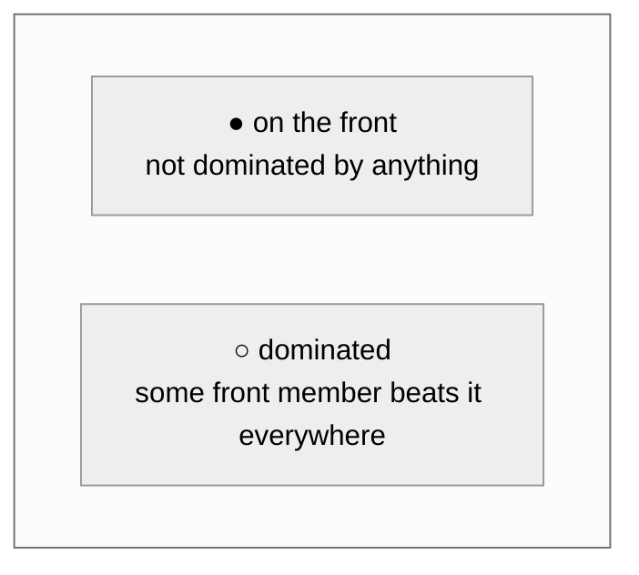

# Multi-objective optimisation

Accuracy is not the only thing that matters. A model that reaches 95% but does not fit in
a microcontroller's flash is not a solution.

## The problem

With one objective, "best" is well defined. With several, it usually is not.

$$
\min_{a \in \mathcal{A}} \; \bigl(f_1(a),\, f_2(a),\, \dots,\, f_m(a)\bigr)
\qquad\text{subject to}\qquad g_j(a) \le 0
$$

Consider three candidates:

| Candidate | Accuracy | Parameters |
| --------- | -------: | ---------: |
| A         |     0.90 |  1 000 000 |
| B         |     0.85 |     50 000 |
| C         |     0.70 |    200 000 |

C is worse than B on both counts — nobody would choose it. But A versus B has no answer
without knowing what you are building. On a server, A. On a phone, B.

## Pareto dominance

Write each candidate's objective vector in **maximisation form**: multiply every
minimisation objective by $-1$ so larger is better everywhere. Then $a$ **dominates** $b$,
written $a \succ b$, when

$$
\forall i:\; a_i \ge b_i \quad\text{and}\quad \exists j:\; a_j > b_j
$$

— at least as good everywhere, strictly better somewhere.

Domination is a **strict partial order**:

- *Irreflexive* — nothing dominates itself.
- *Asymmetric* — $a \succ b$ excludes $b \succ a$.
- *Transitive* — $a \succ b$ and $b \succ c$ imply $a \succ c$.
- **Not total** — A and B above are *incomparable*. No amount of argument resolves which
  is better without a stated preference.

All four properties are asserted by property tests in
[`tests/property/test_search_properties.py`](../../tests/property/test_search_properties.py).

## The Pareto front

The set of non-dominated candidates. Every member represents a trade-off that cannot be
improved on one axis without giving something up on another; every non-member is strictly
worse than some front member on every axis at once.



Reporting the front is the honest answer to a multi-objective search: it hands the decision
back to whoever owns the preference. The generated report prints it, and
`nas-engine pareto` shows it:

```console
$ nas-engine pareto
Objectives:
  maximize validation_accuracy (weight 1, minmax) -> normalised weight 0.833
  minimize trainable_parameters (weight 0.2, log) -> normalised weight 0.167

                       Pareto front (2 candidates)
┏━━━━━━━━━━━━━━━━━━┳━━━━━━━━━━━━━━━━━━━━━┳━━━━━━━━━━━━━━━━━━━━━━┳━━━━━━━━┓
┃ architecture     ┃ validation_accuracy ┃ trainable_parameters ┃  score ┃
┡━━━━━━━━━━━━━━━━━━╇━━━━━━━━━━━━━━━━━━━━━╇━━━━━━━━━━━━━━━━━━━━━━╇━━━━━━━━┩
│ 385cfb98d1da7ad7 │              0.6562 │         112,650.0000 │ 0.8333 │
│ 82f0f1b32eec0da5 │              0.5000 │             924.0000 │ 0.1667 │
└──────────────────┴─────────────────────┴──────────────────────┴────────┘
```

### Non-dominated sorting

Front 0 is the Pareto front. Front 1 is the front of what remains after removing front 0,
and so on. Every candidate gets a rank, and a lower rank is unambiguously better — which is
what makes multi-objective selection possible inside an evolutionary loop.

### Crowding distance

Within a front nothing dominates anything, so a secondary criterion is needed. NSGA-II's
crowding distance measures isolation: for each objective, sort the front and sum each
candidate's normalised gap to its two neighbours. Extremes receive infinite distance so the
ends of the trade-off curve are never discarded.

Preferring high crowding distance spreads selection along the front instead of letting the
population cluster in one region.

### Numerical care

Metrics from short training runs are noisy. Comparing them with exact equality means two
candidates differing by $10^{-15}$ are treated as genuinely different and the front fills
with numerical dust. Comparisons use a relative tolerance of $10^{-9}$, and `pareto_front`
returns candidates in a deterministic order so repeated calls on the same data give
identical output.

`NaN` never dominates and is never dominated: a failed measurement must not win by
accident.

### Complexity

The naive algorithm is $O(n^2 m)$ for $n$ candidates and $m$ objectives. At NAS scale
(hundreds to low thousands) that is milliseconds, and it is chosen over asymptotically
better divide-and-conquer algorithms because it is obviously correct and easy to test.
[`tests/performance`](../../tests/performance/test_performance_guards.py) pins the
practical limits.

## Scalarisation

A leaderboard needs one number. Collapsing $m$ objectives into a scalar is genuinely
useful and lossy, and this project is explicit about how the loss happens.

### Normalisation is not optional

"Maximise validation accuracy" ranges over $[0, 1]$. "Minimise parameter count" ranges over
$[10^3, 10^7]$. A weighted sum of the raw values is dominated *entirely* by the parameter
count; the accuracy term contributes less than one part in a million.

Any weighting that "works" on raw values is really an inverse-scale correction discovered
by trial and error, and it stops working the moment the parameter range shifts.

Normalisation puts every objective on a comparable scale first, so weights express
**preferences** rather than **unit conversions**.

### The five strategies

| Strategy    | Formula                     | Bounded | Stable across runs | Use when                         |
| ----------- | --------------------------- | ------- | ------------------ | -------------------------------- |
| `none`      | $x$                         | No      | Yes                | Objectives already share a scale |
| `minmax`    | $(x - \min)/(\max - \min)$  | $[0,1]$ | **No**             | The default; interpretable       |
| `zscore`    | $(x - \mu)/\sigma$          | No      | **No**             | Outliers would distort min-max   |
| `log`       | min-max of $\log_{10}(1+x)$ | $[0,1]$ | **No**             | Values span orders of magnitude  |
| `reference` | $x / x_{\text{ref}}$        | No      | **Yes**            | Comparing between searches       |

Direction is applied after normalisation: a minimisation objective's bounded value becomes
$1 - \text{scaled}$.

### The population-relative trap

Min-max, z-score, and log are all **population-relative**. Adding one candidate changes
every other candidate's normalised value, and therefore every score.

Consequences, both handled:

1. **Scores are only comparable within one scoring call.** They are recomputed from
   persisted metrics whenever a leaderboard is displayed, never stored as ground truth.
2. **A stored score would silently go stale.** So none is stored.

### Degenerate objectives

If every candidate has the same value for an objective, it carries no information. Min-max
would divide by zero. Here the objective contributes a constant 0.5 to every candidate, so
it neither helps nor distorts.

### The remaining honesty problem

Even normalised, a weighted sum encodes a fixed exchange rate — "1% accuracy is worth 100k
parameters" — that is rarely something anyone believes across the whole range. Someone who
would trade 1% for 100k parameters at the small end will usually not make the same trade at
the large end.

That is why the Pareto front exists alongside the score. The score orders a leaderboard;
the front shows the choice.

[`examples/custom_objective.py`](../../examples/custom_objective.py) makes this concrete by
ranking one set of results four different ways and showing the winner change.

## Online versus final scoring

There is a subtlety that catches people.

Search strategies need one number per candidate, **immediately** after each evaluation:
regularized evolution compares tournament entrants, successive halving promotes the top
fraction. But population-relative normalisation means a value computed at evaluation 10 is
not comparable with one computed at evaluation 200. Storing such a value and comparing it
later would silently corrupt every selection decision, and the corruption would be
invisible — the numbers all look reasonable.

So there are two scorers:

| Aspect | Online scorer | Final scorer |
| --- | --- | --- |
| Used by | Search strategies, during the run | Reports, `best`, `pareto`, after the run |
| Implementation | [`objectives/online.py`](../../src/nas_engine/objectives/online.py) | [`objectives/scoring.py`](../../src/nas_engine/objectives/scoring.py) |
| Normalisation | Stable strategies only (`none`, `reference`) | All five |
| Fallback | The direction-corrected primary metric | — |
| Stable over time | Yes | No, and it does not need to be |

With the default objective set, the online value is simply validation accuracy: the
secondary objectives use `log` and `minmax`, which are excluded. **The consequence is stated
plainly rather than hidden: the secondary objectives shape the final ranking and the Pareto
front, but not the evolutionary trajectory.**

To make latency actually steer the search, give it a `reference` normalisation with an
explicit reference value:

```yaml
objectives:
  objectives:
    - metric: validation_accuracy
      direction: maximize
      normalization: none
    - metric: latency_median_ms
      direction: minimize
      weight: 0.5
      normalization: reference
      reference: 10.0        # 10 ms is the reference point
```

Which forces you to say what a millisecond is worth — exactly the decision that cannot be
made for you.

## Constraints

An objective says "smaller is better". A constraint says "larger than this is unacceptable
at any price".

Encoding a hard requirement as a heavily weighted objective is a common and expensive
mistake: with enough accuracy, a weighted score will always eventually buy its way past the
limit, and a model that cannot fit on the target device gets recommended anyway.

```yaml
objectives:
  constraints:
    - metric: trainable_parameters
      operator: le
      threshold: 2000000
      required: true      # a missing metric makes the candidate infeasible
```

`required: true` is the safe default: an unmeasured latency is not a passing latency.

Infeasible candidates:

- rank below **every** feasible candidate, regardless of score;
- are excluded from the Pareto front, because a front member the user cannot take is not
  an option;
- appear in the report with the violation spelled out.

There are two constraint layers, and they are different:

| Aspect              | Space constraints             | Metric constraints                  |
| ------------------- | ----------------------------- | ----------------------------------- |
| Where               | `search_space.constraints`    | `objectives.constraints`            |
| Evaluated           | Analytically, before training | On measured metrics, after training |
| Cost of a violation | Microseconds                  | A full evaluation                   |
| Outcome             | Candidate is `PRUNED`         | Candidate ranks last                |

Use space constraints for anything derivable from the genotype (parameters, MACs, depth).
Use metric constraints for anything that must be measured (real latency, real serialised
size).

## Ranking: the total order

Five criteria, applied in sequence:

1. **Feasibility.** Constraint violations rank last. A requirement is not a preference.
2. **Pareto front rank.** Lower is better. This respects the multi-objective structure
   *before* any scalarisation, so a front member cannot be pushed below a dominated one by
   a weighting choice.
3. **Weighted score.** Higher is better. Breaks ties within a front.
4. **Primary objective.** Direction-corrected raw value. Kept as a distinct step so the
   ranking is still meaningful when a score could not be computed.
5. **Candidate id.** Lexicographic. Guarantees a total order and byte-identical output
   across runs.

Candidates whose required metrics are missing keep a `None` score and sort last within
their feasibility class, rather than being dropped: a report that silently omits rows is
worse than one that shows them as unscored.

## Missing metrics

| Objective setting                      | Behaviour when the metric is absent               |
| -------------------------------------- | ------------------------------------------------- |
| `required: true` (default)             | The candidate cannot be scored; `score` is `None` |
| `required: false` with `missing_value` | The fallback is used                              |

`missing_value` must be deliberately pessimistic — `.inf` for a minimisation objective —
so a candidate is never rewarded for failing to report a metric. Validation enforces that
an optional objective declares one.

## Where this lives

| Concern                   | File                                                                          |
| ------------------------- | ----------------------------------------------------------------------------- |
| Objectives                | [`objectives/objective.py`](../../src/nas_engine/objectives/objective.py)     |
| Constraints               | [`objectives/constraints.py`](../../src/nas_engine/objectives/constraints.py) |
| Normalisation and scoring | [`objectives/scoring.py`](../../src/nas_engine/objectives/scoring.py)         |
| Dominance and fronts      | [`objectives/pareto.py`](../../src/nas_engine/objectives/pareto.py)           |
| Ranking                   | [`objectives/ranking.py`](../../src/nas_engine/objectives/ranking.py)         |
| Online scalarisation      | [`objectives/online.py`](../../src/nas_engine/objectives/online.py)           |

Tests: [`tests/unit/test_objectives.py`](../../tests/unit/test_objectives.py),
[`tests/property/test_search_properties.py`](../../tests/property/test_search_properties.py),
[`tests/regression/test_golden_fixtures.py`](../../tests/regression/test_golden_fixtures.py).

## See also

- [Interpreting results](../guides/interpreting-results.md) — reading a front in practice.
- [Common pitfalls](common-pitfalls.md) — including why latency comparisons mislead.
