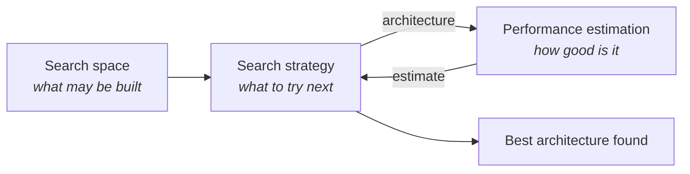

# NAS foundations

What neural architecture search is, stated as an optimisation problem, and why that
problem is hard.

## 1. The problem

Designing a neural network means choosing its structure: how many layers, how wide, which
operations, where to downsample, what to normalise with. Those choices are usually made by
a person, guided by experience and by what worked in the last paper. NAS asks whether they
can be made by search instead.

Formally, let $\mathcal{A}$ be a set of candidate architectures — the **search space**.
Each architecture $a \in \mathcal{A}$ has weights $w$ that are fitted to training data.
Write:

- $\mathcal{L}_{\text{train}}(w, a)$ — the loss on the training split;
- $\mathcal{L}_{\text{val}}(w, a)$ — the loss on the validation split.

The goal is

$$
a^{\star} = \arg\min_{a \in \mathcal{A}} \; \mathcal{L}_{\text{val}}\bigl(w^{\star}(a),\, a\bigr)
\qquad\text{subject to}\qquad
w^{\star}(a) = \arg\min_{w} \; \mathcal{L}_{\text{train}}(w,\, a).
$$

Symbols:

| Symbol                       | Meaning                                                                    |
| ---------------------------- | -------------------------------------------------------------------------- |
| $\mathcal{A}$                | The search space: every architecture the search may consider               |
| $a$                          | One architecture (a *genotype* — see [encoding](architecture-encoding.md)) |
| $w$                          | The weights of a network                                                   |
| $w^{\star}(a)$               | The weights that minimise training loss for architecture $a$               |
| $\mathcal{L}_{\text{train}}$ | Loss on the training split                                                 |
| $\mathcal{L}_{\text{val}}$   | Loss on the validation split                                               |
| $a^{\star}$                  | The optimal architecture                                                   |

## 2. Why this is a bi-level optimisation problem

The equation above has two nested optimisations. The **outer** problem searches over
architectures; the **inner** problem fits weights for a *given* architecture. The outer
objective cannot be evaluated at all without first solving the inner one.

That nesting is the source of every difficulty:

- **The outer problem is discrete.** Architectures are combinatorial objects — a
  convolution is not "0.7 of the way" to a pooling layer. Gradient descent, the tool that
  makes the inner problem tractable, does not directly apply. (Differentiable NAS attacks
  exactly this by relaxing the discrete choice into a continuous mixture; see
  [adding a search strategy](../guides/adding-a-search-strategy.md#3-differentiable-architecture-search-darts).)
- **Each outer evaluation costs an inner optimisation.** One point in the outer search
  costs a full training run. That is minutes on a small problem and GPU-weeks on a large
  one.
- **The outer objective is noisy.** $w^{\star}(a)$ is never actually found; training stops
  early, initialisation is random, and data order varies. What is measured is
  $\mathcal{L}_{\text{val}}(\hat{w}, a)$ for some approximate $\hat{w}$, and that estimate
  has variance. See [section 6](#6-the-objective-is-noisy).

## 3. The three components

Elsken, Metzen, and Hutter's survey decomposes every NAS method into three parts. This
project's package layout follows that decomposition directly.



| Component | Question | This project |
| --- | --- | --- |
| **Search space** | Which architectures are reachable at all? | `nas_engine.search_space` — see [search spaces](search-spaces.md) |
| **Search strategy** | Given what has been observed, what should be tried next? | `nas_engine.search` — [random](random-search.md), [evolution](regularized-evolution.md), [successive halving](successive-halving.md) |
| **Performance estimation** | How good is this architecture, and how cheaply can that be established? | `nas_engine.evaluation` — see [training and evaluation](training-and-evaluation.md) |

The three interact. A tight space makes a weak strategy look good. A cheap, biased
estimator makes a strong strategy chase noise. Reporting a NAS result without describing
all three is not reporting a result.

## 4. Search-space cardinality

Search spaces are astronomically large. This project's default CNN space, with two or
three stages, one to three blocks per stage, five operations, two kernel sizes, three
expansion ratios, two normalisations, two activations, and optional residuals, has an
upper bound of roughly $10^{21}$ members:

```console
$ nas-engine validate-config --config configs/random_search.yaml
  approx. size    : 1e21.2 architectures (upper bound)
```

At one second per evaluation — wildly optimistic — exhausting it would take $3 \times
10^{13}$ years. Enumeration is not merely impractical; it is not on the table. Every NAS
method is a way of sampling a vanishingly small subset intelligently.

The bound is computed by
[`SearchSpace.cardinality_upper_bound`](../../src/nas_engine/search_space/space.py). It
over-counts, because conditional canonicalisation, the monotonic-width rule, and the
resource constraints all remove members — see [search spaces](search-spaces.md#cardinality).

## 5. Constraints and multiple objectives

Real deployments care about more than accuracy. A model that reaches 95% but does not fit
in a microcontroller's flash is not a solution. The problem becomes

$$
\min_{a \in \mathcal{A}} \; \bigl(f_1(a),\, f_2(a),\, \dots,\, f_m(a)\bigr)
\qquad\text{subject to}\qquad g_j(a) \le 0 \;\; \text{for } j = 1, \dots, k
$$

where the $f_i$ are objectives (negative accuracy, parameter count, latency, model size)
and the $g_j$ are hard constraints.

With $m > 1$ there is generally no single minimiser. The solution is the **Pareto set**:
architectures that cannot be improved on one objective without being made worse on
another. [Multi-objective optimisation](multi-objective-optimization.md) develops this
properly.

Objectives and constraints are different in kind, and the distinction matters. An
objective says "smaller is better"; a constraint says "larger than this is unacceptable at
any price". Encoding a hard requirement as a heavily weighted objective means a
sufficiently accurate model can always buy its way past the limit.

## 6. The objective is noisy

$\mathcal{L}_{\text{val}}$ is estimated from a finite validation split with weights from a
finite, randomly initialised training run. Two sources of noise:

**Finite-sample noise.** With $n$ validation examples and true accuracy $p$, the measured
accuracy has standard error

$$
\mathrm{SE} = \sqrt{\frac{p(1-p)}{n}}.
$$

For $n = 1000$ and $p = 0.7$, that is 1.4 percentage points. A difference of 1% between
two candidates is *within one standard error* — it is not evidence.

**Training noise.** The same architecture trained twice with different seeds reaches
different accuracies. On short budgets the spread is often larger than the finite-sample
noise.

Two consequences shape this project's design:

1. **Ranking is unstable.** The ordering of two similar candidates can flip between runs.
   Search algorithms must not treat a single measurement as ground truth — which is exactly
   why [regularized evolution](regularized-evolution.md) removes the *oldest* population
   member rather than the worst.
2. **Selection bias is real.** Taking the maximum over $N$ noisy estimates
   systematically overestimates the true value of the winner. With enough candidates,
   something scores well by luck. This is why the winner's validation accuracy is
   optimistically biased, and why the held-out test split exists.

## 7. Exploration versus exploitation

Every search strategy balances two impulses:

- **Exploitation** — try architectures similar to what already works. Cheap, reliable
  local improvement, and prone to getting stuck.
- **Exploration** — try something different. Occasionally finds a much better region, and
  usually wastes the evaluation.

Where each strategy sits:

| Strategy              | Exploration                     | Exploitation          | Control            |
| --------------------- | ------------------------------- | --------------------- | ------------------ |
| Random search         | Total                           | None                  | —                  |
| Regularized evolution | Population diversity plus aging | Tournament selection  | `tournament_size`  |
| Successive halving    | Broad at rung 0                 | Narrow at later rungs | `reduction_factor` |

In evolution, tournament size is the dial: $S = 1$ selects uniformly and is a random walk;
$S = P$ always picks the current best and collapses diversity within a few generations.
Aging adds exploration for free by bounding every member's lifetime.

## 8. Budget allocation

Given a total compute budget $B$, how should it be spent? Two extremes:

- **Many cheap evaluations.** $N$ large, per-evaluation budget $b$ small. Covers more of
  the space, but each measurement is noisier and more biased.
- **Few expensive evaluations.** $N$ small, $b$ large. Each measurement is trustworthy, but
  very little of the space is seen.

Successive halving refuses the choice: spend little on everything, then more on the
survivors. With $n$ initial candidates, reduction factor $\eta$, and $R$ rungs:

$$
n_r = \left\lfloor n\,\eta^{-r} \right\rfloor, \qquad b_r = b_0\,\eta^{r}
$$

so each rung costs about $n b_0$ and the total is about $R n b_0$. Training everything to
full fidelity would cost $n b_0 \eta^{R-1}$. The saving is roughly $\eta^{R-1} / R$.

This is only free if low-fidelity rank predicts high-fidelity rank.
[Successive halving](successive-halving.md#the-assumption-stated-plainly) is explicit about
when it does not.

## 9. Proxy objectives and surrogate metrics

A **proxy** is a cheap stand-in for the thing you actually care about:

| Real quantity                     | Proxy used here                        | Where it breaks                          |
| --------------------------------- | -------------------------------------- | ---------------------------------------- |
| Test accuracy after full training | Validation accuracy after a few epochs | Slow-starting architectures              |
| Deployed inference latency        | Latency measured on this machine       | Different hardware, different batch size |
| Deployed memory footprint         | Serialised model size                  | Runtime activation memory is not counted |
| Compute cost                      | Multiply-accumulate count              | Memory bandwidth often dominates         |

Every proxy in this project is labelled as one. MACs in particular are widely misread as a
latency proxy: a depthwise convolution has few MACs and poor arithmetic intensity, so it
is frequently *slower* per MAC than a dense convolution. That is why latency is measured
rather than derived — see [`evaluation/latency.py`](../../src/nas_engine/evaluation/latency.py).

## 10. Weight sharing, and why this project does not use it

One-shot NAS trains a single over-parameterised "supernet" containing every candidate as a
subnetwork, then evaluates candidates by inheriting supernet weights. It is dramatically
cheaper — one training run instead of thousands.

It is also **biased**. Subnetworks share weights, so a candidate's inherited weights were
shaped by training every *other* candidate too. Published analyses repeatedly find that
supernet ranking correlates only weakly with the ranking obtained by training candidates
independently, and the bias is systematic rather than random noise.

This project trains every candidate **independently**. That is slower and it is honest:
each measurement means what it appears to mean. Weight sharing is a documented extension
point, not a hidden default. See
[adding a search strategy](../guides/adding-a-search-strategy.md).

## 11. Comparing methods fairly

A NAS comparison is only meaningful if it controls for total compute. Two rules:

1. **Count the search cost.** "Method X found a 94% model, method Y found 93%" says
   nothing if X used ten times the compute. Report GPU-hours, or evaluation-epochs, or any
   consistent unit — and report it for the search, not just for the final training run.
2. **Hold the space fixed.** Comparing method X on space 1 against method Y on space 2
   compares the spaces at least as much as the methods.

This project makes the first easy: `TrainingBudget.relative_cost` gives a dimensionless
cost per evaluation, and the report totals the evaluations and the wall-clock duration.

## 12. Where this lives in the code

| Concept                                    | Module                                                                        |
| ------------------------------------------ | ----------------------------------------------------------------------------- |
| Search space $\mathcal{A}$                 | [`search_space/space.py`](../../src/nas_engine/search_space/space.py)         |
| Architecture $a$                           | [`architectures/spec.py`](../../src/nas_engine/architectures/spec.py)         |
| Inner optimisation $w^{\star}(a)$          | [`training/trainer.py`](../../src/nas_engine/training/trainer.py)             |
| Outer objective $\mathcal{L}_{\text{val}}$ | [`evaluation/evaluator.py`](../../src/nas_engine/evaluation/evaluator.py)     |
| Search strategy                            | [`search/strategy.py`](../../src/nas_engine/search/strategy.py)               |
| Constraints $g_j$                          | [`objectives/constraints.py`](../../src/nas_engine/objectives/constraints.py) |
| Pareto set                                 | [`objectives/pareto.py`](../../src/nas_engine/objectives/pareto.py)           |
| Budget allocation                          | [`evaluation/budget.py`](../../src/nas_engine/evaluation/budget.py)           |

## Further reading

- Elsken, Metzen, Hutter, *Neural Architecture Search: A Survey* (JMLR 2019) — the
  three-component decomposition used above.
- Real, Aggarwal, Huang, Le, *Regularized Evolution for Image Classifier Architecture
  Search* (AAAI 2019) — aging evolution.
- Li, Jamieson, DeSalvo, Rostamizadeh, Talwalkar, *Hyperband* (JMLR 2018) — successive
  halving and its bracket extension.
- Li and Talwalkar, *Random Search and Reproducibility for NAS* (UAI 2019) — why random
  search is a strong baseline and why reproducibility in NAS is difficult.
- Bergstra and Bengio, *Random Search for Hyper-Parameter Optimization* (JMLR 2012) — the
  original argument for random over grid search.
