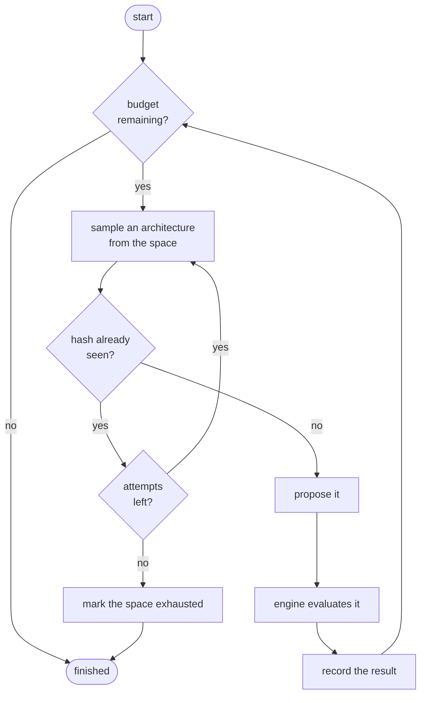

# Random search

The baseline. Sample architectures uniformly from the space, train each, keep the best.

It is the first strategy you should run and the one every other strategy must beat.

## Why the baseline is strong

The instinct is that random search must be weak — it uses no information. In NAS it is
repeatedly competitive, for three reasons.

**Low effective dimensionality.** Bergstra and Bengio's argument for hyperparameter
optimisation transfers directly: when only a few of the many dimensions actually matter,
random sampling covers those few far better than a grid. A grid with $k$ values per
dimension spends most of its budget varying dimensions that do not matter; random sampling
gives every dimension $N$ distinct values.

**The space does most of the work.** A [well-designed space](search-spaces.md) has already
excluded the bad architectures. Sampling from what remains is not as naive as it sounds.

**Noise limits what any method can exploit.** With a validation standard error of a
percentage point or two, an adaptive method's "signal" is partly noise. Random search
cannot be misled by noise because it does not listen.

Li and Talwalkar's *Random Search and Reproducibility for NAS* found random search with
early stopping competitive with several published methods on equal compute. That is the
result to keep in mind when reading any NAS claim.

## The algorithm



Ten lines of pseudocode. The care is in the details.

## Getting it right

A careless implementation is worse than useless: it becomes an invalid baseline, and every
comparison against it is wrong.

### 1. Seeded and reproducible

The strategy owns a private `random.Random`. It never touches the global RNG, so its
output depends only on its seed and on how many times it has been called — not on what any
other component did.

```python
def run() -> list[str]:
    strategy = RandomSearch(space, seed=3, max_evaluations=6, budget=budget)
    return [architecture_hash(p.spec) for p in strategy.propose(6)]

assert run() == run()   # tests/regression/test_determinism.py
```

### 2. Duplicate-avoiding

Re-training an architecture already evaluated yields no information and costs a full
budget. Every hash seen — proposed, evaluated, or failed — is remembered, and
`sample_unique` redraws until it finds something novel.

Duplicate avoidance happens twice, deliberately: the strategy avoids proposing them, and
[the engine rejects them anyway](architecture-encoding.md#equality-and-duplicate-detection)
because a resumed search may hold hashes the strategy's checkpoint predates.

### 3. Honest about exhaustion

In a small space, novel candidates run out. The strategy reports that as completion rather
than looping forever:

```python
strategy = RandomSearch(micro_space, seed=6, max_evaluations=100, budget=budget,
                        max_consecutive_exhaustions=1)
# ...
assert strategy.is_finished()
assert strategy.statistics().extra["exhausted"] is True
```

`max_consecutive_exhaustions` defaults to 3 rather than 1 because sampling is
probabilistic: one unlucky run of duplicates is not proof of exhaustion.

### 4. Constraint-aware

Sampling delegates to
[`ArchitectureSampler`](../../src/nas_engine/search_space/sampler.py), so search-space
constraints are enforced during generation rather than by the engine rejecting proposals
afterwards. The strategy never sees an infeasible candidate.

### 5. Resumable

The full Mersenne Twister state is checkpointed, not just the seed. Re-seeding on resume
would *replay* the proposals already evaluated — the search would appear to run and
produce nothing new.

```python
original.propose(3)
state = original.state_dict()
expected = [architecture_hash(p.spec) for p in original.propose(3)]

restored = RandomSearch(space, seed=999, max_evaluations=10, budget=budget)
restored.load_state_dict(state)
assert [architecture_hash(p.spec) for p in restored.propose(3)] == expected
```

That property is tested for every strategy in
[`tests/property/test_search_properties.py`](../../tests/property/test_search_properties.py).

## Configuration

```yaml
algorithm:
  name: random_search
  params:
    sample_attempts: 200              # draws per proposal before giving up on novelty
    max_consecutive_exhaustions: 3    # failed novelty searches before declaring exhaustion

budget:
  max_evaluations: 20
  epochs: 5
```

That is the whole surface. Random search has no hyperparameters to tune, which is another
reason it makes a clean baseline: there is no "we did not tune it properly" defence when it
wins.

## What it reports

```python
{
    "proposed": 20,
    "observed": 20,
    "succeeded": 20,
    "failed": 0,
    "duplicates_avoided": 0,
    "unique_architectures": 20,
    "exhausted": False,
    "sampler": {"attempts": 23, "accepted": 20, "rejected": 3,
                "acceptance_rate": 0.87,
                "rejection_reasons": {"constraint:multiply_accumulates": 3}},
}
```

The `sampler` block is the useful part. A low acceptance rate means a constraint is
fighting the space; the reasons say which one.

## When to use it

**Always, first.** Run random search before anything else, at the compute budget you plan
to spend. Then run the fancier method at *the same total compute* and compare. If it does
not clearly win, the extra machinery is not earning its keep.

**As a control.** When an evolutionary run produces a surprising result, the question is
whether the surprise came from the algorithm or from the space. Random search over the same
space answers it.

**When the space is small.** Below a few thousand members, adaptive search has little room
to help and duplicate avoidance dominates.

**When evaluations are extremely noisy.** If the validation standard error is comparable to
the spread between candidates, adaptive methods are fitting noise. Random search is not.

## When to reach for something else

- **Large space, tight budget.** Twenty samples from $10^{21}$ is not coverage. Evolution
  concentrates the budget on promising neighbourhoods.
- **Cheap low-fidelity evaluation available.** Successive halving buys many more samples
  from the same compute.
- **Local structure matters.** If small changes to a good architecture reliably produce
  other good architectures, an algorithm that exploits that will beat one that ignores it.

## Where this lives

| Concern        | Location                                                                                 |
| -------------- | ---------------------------------------------------------------------------------------- |
| Implementation | [`search/random_search.py`](../../src/nas_engine/search/random_search.py)                |
| Sampling       | [`search_space/sampler.py`](../../src/nas_engine/search_space/sampler.py)                |
| Configuration  | [`configs/random_search.yaml`](../../configs/random_search.yaml)                         |
| Unit tests     | [`tests/unit/test_strategies.py`](../../tests/unit/test_strategies.py)                   |
| End-to-end     | [`tests/end_to_end/test_full_searches.py`](../../tests/end_to_end/test_full_searches.py) |

## See also

- [Regularized evolution](regularized-evolution.md) — the adaptive alternative.
- [Successive halving](successive-halving.md) — spending the same budget differently.
- [NAS foundations](nas-foundations.md#11-comparing-methods-fairly) — comparing fairly.
