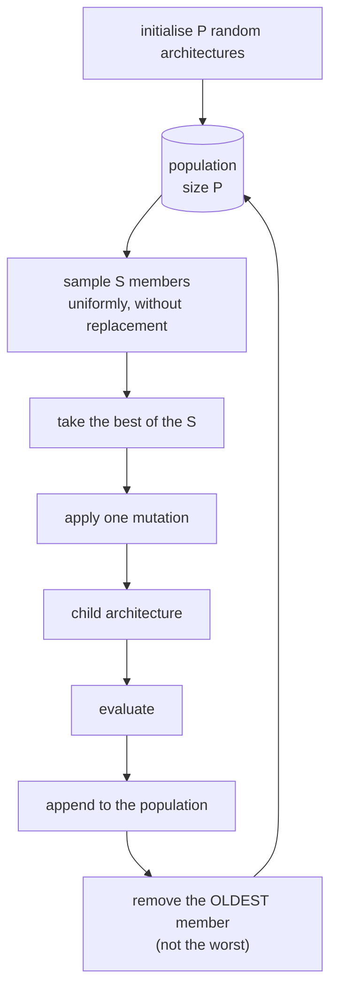

# Regularized evolution

Also called **aging evolution**. A population of architectures, tournament selection,
mutation — and one unusual rule that makes the whole thing work.

## The algorithm

1. Initialise a population of $P$ random architectures.
2. Repeat until the budget is spent:
   1. Sample $S$ distinct members uniformly at random — a **tournament**.
   2. Take the best of those $S$ as the **parent**.
   3. **Mutate** the parent to produce a child.
   4. Evaluate the child and append it to the population.
   5. Remove the **oldest** member of the population.



Everything interesting is in the last step.

## Why remove the oldest, not the worst?

Classic evolution removes the worst member, making the population a monotonically
improving elite set. That sounds obviously right, and it creates a specific failure mode.

Validation accuracy after a short training run is a
[noisy estimate](nas-foundations.md#6-the-objective-is-noisy). Over enough candidates,
*something* gets a lucky draw: favourable initial weights, a fortunate data order, a
validation split that happens to suit it. Under worst-removal that lucky candidate is
**immortal**. It sits in the population forever, wins tournaments it does not deserve, and
the search collapses onto its neighbourhood.

The search is then optimising measurement noise.

Aging removes the oldest member regardless of how good it is. Every architecture has a
bounded lifetime of exactly $P$ subsequent evaluations. To persist in the gene pool a
lineage must keep producing children that score well — repeatedly, on independent training
runs with independent noise. A one-off lucky measurement cannot do that.

So aging is an **implicit regulariser**. It selects for architectures that are *reliably*
good rather than *once* lucky, and it maintains exploration because the population keeps
turning over. Real et al. found aging evolution outperforming both non-aging evolution and
reinforcement learning under equal compute.

The rule is one line, and it is asserted directly:

```python
# tests/unit/test_strategies.py
def test_aging_removes_the_oldest_not_the_worst(self, tiny_space):
    strategy = self._strategy(tiny_space, population_size=2)
    proposals = strategy.propose(2)
    strategy.observe(_observation(proposals[0], value=10.0))   # by far the best
    strategy.observe(_observation(proposals[1], value=0.1))
    best_hash = architecture_hash(proposals[0].spec)
    assert best_hash in {m.architecture_hash for m in strategy.population}

    for _ in range(2):
        for proposal in strategy.propose(1):
            strategy.observe(_observation(proposal, value=0.2))
    assert best_hash not in {m.architecture_hash for m in strategy.population}
```

Implementation: a `collections.deque(maxlen=P)`. Appending past the limit discards from the
left automatically, which *is* the aging rule.

## Tournament selection

Sampling $S$ members and taking the best is a **soft** selection pressure. Compared with
always picking the population's best, it lets a merely-good architecture win sometimes,
which preserves diversity.

$S$ is the dial:

| $S$   | Behaviour                                                              |
| ----- | ---------------------------------------------------------------------- |
| 1     | Uniform selection — a random walk through the space                    |
| $P/4$ | The common compromise, and this project's default                      |
| $P$   | Always the current best — diversity collapses within a few generations |

Sampling is **without replacement**, so a tournament of size $S$ really compares $S$
distinct members. With replacement, the effective pressure would be lower than configured
and would drift with population size.

Ties break by architecture hash, so the winner is deterministic.

## Mutation

A mutation changes **one** decision. Large jumps turn evolution into random search and
destroy the local-search signal that makes it work.

Twelve operators, in
[`search_space/mutation.py`](../../src/nas_engine/search_space/mutation.py):

| Operator          | Changes                                |
| ----------------- | -------------------------------------- |
| `operation`       | One block's primitive                  |
| `kernel_size`     | One block's kernel                     |
| `expansion_ratio` | One separable block's bottleneck width |
| `activation`      | One block's nonlinearity               |
| `normalization`   | One block's normalisation              |
| `residual`        | Toggles a shortcut where one is legal  |
| `stride`          | A stage's first-block stride           |
| `stage_width`     | A stage's width                        |
| `stage_depth`     | Adds or removes a block                |
| `num_stages`      | Adds or removes a stage                |
| `stem`            | One stem field                         |
| `head`            | One head field                         |

Every operator guarantees four things:

1. **Purity.** The parent is never modified. Genotypes are frozen and every operator builds
   a new object. Asserted by a property test over every operator.
2. **Locality.** One decision changes.
3. **Closure.** The child stays inside the space. Operators only choose from the space's own
   choice sets, and repair restores global invariants afterwards.
4. **Progress.** An operator either produces a genuinely different genotype or declines by
   returning `None`.

### Applicability

Not every operator applies to every parent. There is no expansion ratio to change if the
architecture contains no separable block; depth cannot grow past `blocks_per_stage`.
Operators *declare inapplicability* rather than failing, and `MutationOperator` samples
uniformly from those that apply — which keeps the effective mutation distribution well
defined even as architectures change shape.

### Repair

Mutation is local; architectures have global invariants. Widening stage 1 invalidates every
downstream pooling block's declared channel count.

Two possible responses:

- **Reject and resample.** Simple, wasteful, and it *skews the mutation distribution*
  towards whichever changes happen to be locally safe.
- **Repair.** Apply the change, then restore the invariants with a deterministic, minimal
  rewrite.

This project repairs. [`repair_architecture`](../../src/nas_engine/search_space/repair.py)
is deterministic (so it cannot inject hidden randomness into a seeded search), minimal (it
only touches inconsistent fields), and idempotent (verified by a property test).

The cost: a mutation's effect is not always exactly what was requested. Widening stage 1
also rewrites the declared widths of that stage's pooling blocks. The mutation record
describes the *requested* change; the hash is the source of truth for identity.

## Failure handling

A candidate that failed to evaluate has no fitness, so it never enters the population. If
*every* initial candidate fails, the strategy falls back to random sampling rather than
deadlocking on an empty population — and logs that it did, because a fully failing
population means something is wrong with the configuration, not with the search:

```text
[warning] evolution.empty_population  proposed=4 observed=4 failed=4
          action='falling back to random sampling'
```

## Configuration

```yaml
algorithm:
  name: regularized_evolution
  params:
    population_size: 16
    tournament_size: 4            # defaults to population_size // 4
    allow_duplicate_children: false
    mutation_attempts: 25

budget:
  max_evaluations: 40
```

### Choosing the population size

$P$ sets how long an architecture survives — exactly $P$ subsequent evaluations.

- **Too small** (say 4 with a budget of 100): the population turns over 25 times, good
  lineages are evicted before they can be exploited, and behaviour approaches random search.
- **Too large** (say 50 with a budget of 100): the initialisation phase consumes half the
  budget and only 50 mutations ever happen.

A rule of thumb: $P \approx \text{max\_evaluations} / 4$, so the population turns over about
four times.

### Choosing the tournament size

Start at $P/4$. Raise it if the search seems to wander; lower it if the population loses
diversity (watch `population.unique` in the statistics — if it falls well below
`population.size`, pressure is too high).

## What it reports

```python
{
    "proposed": 40, "observed": 40, "succeeded": 38, "failed": 2,
    "population": {"size": 16.0, "unique": 15.0, "best": 0.71,
                   "worst": 0.42, "mean": 0.58, "std": 0.09},
    "generation": 38,
    "retired": 22,                 # members evicted by aging
    "random_fallbacks": 1,         # times mutation could not produce a novel child
    "mutation_failures": 0,
    "mutation_operators": {"by_operator": {"kernel_size": 8, "stage_width": 6, ...}},
}
```

Diagnostics worth watching:

- **`population.unique` well below `population.size`** — the population has converged.
  Lower the tournament size or widen the space.
- **`random_fallbacks` climbing** — mutation keeps producing already-seen architectures.
  The neighbourhood is saturated.
- **`population.std` near zero** — every member scores the same. Either the space is too
  narrow or the evaluation budget is too small to discriminate.

## When to use it

**Large space, moderate budget** (30–200 evaluations). Enough to fill a population and run
several generations.

**When local structure exists.** If good architectures have good neighbours, evolution
exploits that and random search cannot.

**When you want lineage.** The ancestry forest shows which mutations mattered, which is
genuinely informative about the space.

## When not to

- **Very small budgets** (under about 20). The initialisation phase would eat everything.
- **Very small spaces.** Mutation runs out of novel neighbours and degenerates into random
  sampling with extra steps.
- **Extremely noisy evaluation.** Aging mitigates noise but does not eliminate it; if the
  spread between candidates is smaller than the noise, selection is arbitrary.

## Where this lives

| Concern            | Location                                                                    |
| ------------------ | --------------------------------------------------------------------------- |
| Implementation     | [`search/evolution.py`](../../src/nas_engine/search/evolution.py)           |
| Mutation operators | [`search_space/mutation.py`](../../src/nas_engine/search_space/mutation.py) |
| Repair             | [`search_space/repair.py`](../../src/nas_engine/search_space/repair.py)     |
| Lineage            | [`architectures/lineage.py`](../../src/nas_engine/architectures/lineage.py) |
| Configuration      | [`configs/evolution.yaml`](../../configs/evolution.yaml)                    |
| Tests              | [`tests/unit/test_strategies.py`](../../tests/unit/test_strategies.py)      |

## Further reading

Real, Aggarwal, Huang, Le, *Regularized Evolution for Image Classifier Architecture
Search*, AAAI 2019 — the paper this implements, including the ablation showing aging
beating non-aging evolution.
