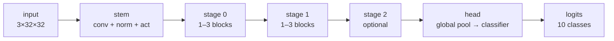

# Search spaces

The set of architectures a search may consider — and the single highest-leverage design
choice in the whole system.

## Why the space matters more than the algorithm

Published comparisons repeatedly find that random search over a well-designed space
matches much more sophisticated methods over the same space. That is not an argument
against better algorithms; it is an argument that the space does most of the work. A space
encodes prior knowledge: "convolutional networks are organised in stages", "width grows as
resolution shrinks", "residual connections help". Each such constraint removes a vast
region of bad architectures before the search algorithm sees them.

The corollary is uncomfortable: **a strong NAS result is partly a property of the space,
not only of the method.** Reporting one without the other is incomplete.

## What a space is here

A [`SearchSpace`](../../src/nas_engine/search_space/space.py) is a frozen, validated
Pydantic model with three kinds of content.

### Macro choices — the network's overall shape

| Field              | Meaning                                             | Default             |
| ------------------ | --------------------------------------------------- | ------------------- |
| `num_stages`       | Permitted stage counts                              | `(2, 3)`            |
| `blocks_per_stage` | Permitted blocks within a stage                     | `(1, 2, 3)`         |
| `stage_channels`   | Permitted stage widths                              | `(16, 32, 64, 128)` |
| `stage_strides`    | Permitted strides for a stage's first block         | `(1, 2)`            |
| `monotonic_widths` | Whether a stage may be narrower than the one before | `True`              |

### Micro choices — what a single block does

| Field                    | Meaning                                   | Default                                         |
| ------------------------ | ----------------------------------------- | ----------------------------------------------- |
| `block.operations`       | Which primitives                          | conv, dw-sep conv, identity, max-pool, avg-pool |
| `block.kernel_sizes`     | Spatial extent (odd only)                 | `(3, 5)`                                        |
| `block.expansion_ratios` | Inverted-bottleneck widths                | `(1.0, 2.0, 4.0)`                               |
| `block.normalizations`   | Normalisation layers                      | batch, group                                    |
| `block.activations`      | Nonlinearities                            | ReLU, SiLU                                      |
| `block.allow_residual`   | Whether identity shortcuts may be sampled | `True`                                          |

Plus `stem` (the entry convolution) and `head` (the classifier).

### Constraints — hard feasibility limits

| Field                      | Meaning                                                            |
| -------------------------- | ------------------------------------------------------------------ |
| `max_parameters`           | Upper bound on trainable parameters                                |
| `min_parameters`           | Lower bound; stops the search collapsing onto all-pooling networks |
| `max_multiply_accumulates` | Upper bound on MACs per image                                      |
| `max_total_stride`         | Upper bound on the product of all strides                          |
| `min_final_resolution`     | Minimum spatial extent of the final feature map                    |
| `max_depth`                | Upper bound on total block count                                   |

## The stage/block structure

Every architecture in this space has the same skeleton:



A **stage** is a group of blocks operating at one resolution family. By convention:

- The **first block** of a stage owns the stride and the width change.
- **Later blocks** keep the stage width at stride 1.

That convention is not decoration. It is what makes shape validity almost automatic: a
channel-preserving operation (identity, pooling) can only appear where the width is
unchanged, which after the first block is everywhere. Without it, the sampler would draw a
large fraction of structurally invalid candidates and throw them away.

The convention is enforced in three places, independently:

1. The [sampler](../../src/nas_engine/search_space/sampler.py) only offers legal operations
   per position.
2. [Repair](../../src/nas_engine/search_space/repair.py) restores it after a mutation.
3. [Membership validation](../../src/nas_engine/search_space/validation.py) checks it.

## Conditional choices

Some choices only matter given other choices:

| Choice                        | Active when                                                      |
| ----------------------------- | ---------------------------------------------------------------- |
| `kernel_size`                 | The operation is not identity                                    |
| `expansion_ratio`             | The operation is a depthwise-separable convolution               |
| `normalization`, `activation` | The operation is parametric                                      |
| `use_residual`                | Input and output shapes match, and the operation is not identity |
| `head.activation`             | The head has a hidden layer                                      |

This is a **conditional search space**, and it creates a subtle problem. Two genotypes that
differ only in an *inactive* field build byte-identical models. If both were stored, the
engine would train the same network twice and count it as two distinct candidates.

The solution is canonicalisation: inactive fields are forced to a fixed sentinel value at
construction time.

```python
>>> from nas_engine import BlockSpec, OperationType
>>> block = BlockSpec(operation=OperationType.MAX_POOL, kernel_size=3, expansion_ratio=4.0)
>>> block.expansion_ratio     # pooling has no expansion ratio
1.0
>>> block.normalization       # pooling has nothing to normalise
<NormalizationType.NONE: 'none'>
```

[Architecture encoding](architecture-encoding.md) develops this fully. It is verified by
property tests in
[`tests/property/test_architecture_properties.py`](../../tests/property/test_architecture_properties.py).

## Cardinality

`SearchSpace.cardinality_upper_bound()` multiplies independent choice counts:

$$
|\mathcal{A}| \le
\underbrace{|\text{stem}|}_{\text{stem choices}} \times
\underbrace{|\text{head}|}_{\text{head choices}} \times
\sum_{n \in \text{num\_stages}} \Bigl( \sum_{d \in \text{blocks\_per\_stage}}
|\text{widths}| \cdot |\text{strides}| \cdot c^{\,d} \Bigr)^{n}
$$

where $c$ is the per-block choice count. It is an **upper bound**: canonicalisation
collapses conditional duplicates, the monotonic-width rule removes orderings, and the
constraints prune more. The true count is smaller — but the order of magnitude is the
point, and the point is that enumeration is impossible.

```console
$ python -c "from nas_engine import get_preset; s=get_preset('default_cnn'); print(f'1e{s.log10_cardinality():.1f}')"
1e21.2
```

## Constraints: rejection versus construction

There are two ways to keep candidates inside a resource budget:

**Construction** — only generate feasible candidates. No waste, but the generator must
understand every constraint, which entangles sampling with costing and makes new
constraints expensive to add.

**Rejection** — generate freely, then discard the infeasible. Simple, composable, and
wasteful when the acceptance rate is low.

This project uses rejection, with two mitigations:

1. The check is **analytic**. `compute_cost` derives the parameter count and MACs from the
   genotype without allocating a tensor, in about 50 microseconds — roughly 80 times
   cheaper than building the model. Rejecting is nearly free.
2. The **rejection rate is reported**. `sampler.statistics` records why draws were
   rejected, so a badly configured constraint surfaces as a diagnosable number rather than
   a mysterious stall:

```python
>>> sampler.statistics.to_dict()
{'attempts': 56, 'accepted': 50, 'rejected': 6, 'acceptance_rate': 0.89,
 'rejection_reasons': {'constraint:multiply_accumulates': 6}}
```

If the acceptance rate collapses, the message names the culprit:

```text
failed to sample a valid architecture in 200 attempts. Most common rejection reasons:
[('constraint:multiply_accumulates', 200)]. Relax the search-space constraints
(max_parameters, max_multiply_accumulates, min_final_resolution) or widen the choice sets.
```

An infeasible-by-construction constraint is caught before the search starts, by
`SearchSpace.require_non_empty()`.

## Bias, stated explicitly

Every space encodes assumptions. This one's, and what each excludes:

| Assumption                                  | Excludes                                                           |
| ------------------------------------------- | ------------------------------------------------------------------ |
| Stage/block structure                       | Irregular topologies, arbitrary DAGs, cross-stage connections      |
| Monotonic widths (default)                  | Networks that widen then narrow — hourglass and autoencoder shapes |
| Only the first block of a stage downsamples | Late-stage downsampling within a stage                             |
| Identity residuals only                     | Projection shortcuts, which would add hidden parameters            |
| Odd kernels only                            | Even kernels, which cannot use exact same-padding                  |
| Channel counts rounded to multiples of 8    | Fine-grained width tuning                                          |
| Global pooling head                         | Flattened classifiers, and therefore fixed-resolution models       |

None of these is a law. `monotonic_widths=False` turns one off; the others are structural
and would require code changes. They are listed here so that a result from this space is
read as a result *from this space*.

## The three shipped presets

| Preset        | Purpose                                | Size       | Input             |
| ------------- | -------------------------------------- | ---------- | ----------------- |
| `default_cnn` | Demonstration and real searches        | ~$10^{21}$ | 32×32, 10 classes |
| `tiny_cnn`    | The test suite: seconds, not minutes   | ~$10^{5}$  | 16×16, 4 classes  |
| `micro_cnn`   | Exhaustion behaviour: only two members | 2          | 8×8, 3 classes    |

`micro_cnn` exists so the "space exhausted" path can actually be tested. A search over it
runs out of novel candidates after two evaluations and stops cleanly, which is asserted in
[`tests/failure_recovery/test_failure_recovery.py`](../../tests/failure_recovery/test_failure_recovery.py).

## Sampling

[`ArchitectureSampler`](../../src/nas_engine/search_space/sampler.py) draws hierarchically
rather than picking a random point in a flat product space:

1. Choose the stem.
2. Choose the number of stages.
3. Choose each stage's width, honouring monotonicity.
4. Choose each stage's depth and first-block stride.
5. Choose each block from the operations legal *at that position*.
6. Choose the head.
7. Repair, then validate. Retry on rejection.

Two properties matter:

- **It owns a private generator.** Nothing touches the global RNG, so sampling is
  unaffected by unrelated code drawing random numbers. This is asserted by
  `test_random_module_is_never_used_implicitly`.
- **The draw count per block is fixed.** Every conditional field is drawn even when
  inactive, so changing which operation is selected does not shift every subsequent draw
  in the stream. That makes seeded runs far easier to reason about.

## Designing a space

Practical advice, in order of impact:

1. **Start small.** A space of $10^6$ that you understand beats $10^{30}$ that you do not.
   Widen once you can see which dimensions matter.
2. **Include a known-good architecture.** If a hand-designed baseline is not a member, the
   search cannot match it, and you will not know whether a poor result is the space or the
   algorithm.
3. **Set `min_parameters`.** Without it, degenerate all-pooling networks train fast, score
   near chance, and clutter the Pareto front's low-parameter end.
4. **Prefer few dimensions with many values** over many dimensions with two values each.
   Random search covers the former far better.
5. **Check the acceptance rate** after a short run. Below about 50%, a constraint is
   fighting the sampler.
6. **Watch the duplicate count.** A high count means the space is nearly exhausted, and
   more budget will buy nothing.

## Where this lives

| Concern                         | File                                                                            |
| ------------------------------- | ------------------------------------------------------------------------------- |
| Space definition and validation | [`search_space/space.py`](../../src/nas_engine/search_space/space.py)           |
| Presets                         | [`search_space/presets.py`](../../src/nas_engine/search_space/presets.py)       |
| Sampling                        | [`search_space/sampler.py`](../../src/nas_engine/search_space/sampler.py)       |
| Repair                          | [`search_space/repair.py`](../../src/nas_engine/search_space/repair.py)         |
| Mutation                        | [`search_space/mutation.py`](../../src/nas_engine/search_space/mutation.py)     |
| Validation                      | [`search_space/validation.py`](../../src/nas_engine/search_space/validation.py) |

Tests: [`tests/unit/test_search_space.py`](../../tests/unit/test_search_space.py) and
[`tests/property/test_search_properties.py`](../../tests/property/test_search_properties.py).

## See also

- [Defining search spaces](../guides/defining-search-spaces.md) — the how-to.
- [Adding an operation](../guides/adding-an-operation.md) — extending the vocabulary.
- [ADR 0001](../adr/0001-search-space-representation.md) — why this representation.
