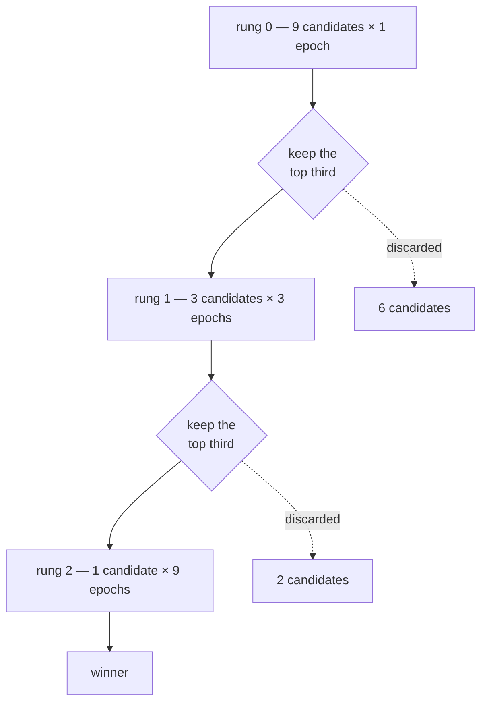

# Successive halving

Evaluate many candidates cheaply, keep the best fraction, re-evaluate the survivors with
more resources. Repeat.

## The idea

Training every candidate to convergence is the accurate way to rank architectures and the
most wasteful. Most candidates are obviously bad after a small fraction of the budget.
Successive halving exploits that.



With $n$ initial candidates, reduction factor $\eta$, and $R$ rungs:

$$
n_r = \left\lfloor n\,\eta^{-r} \right\rfloor, \qquad b_r = b_0\,\eta^{\,r}
$$

Each rung therefore costs roughly $n_r b_r \approx n b_0$ — the **same compute per rung** —
and the total is about $R \cdot n \cdot b_0$.

Training all $n$ candidates at the highest fidelity would cost $n b_0 \eta^{R-1}$. The
saving is about

$$
\frac{\eta^{R-1}}{R}.
$$

For $\eta = 3, R = 3$ that is 3×. For $\eta = 3, R = 5$ it is 16×. The saving grows with
the ladder.

Worked example, the shipped configuration:

| Rung      | Candidates         | Epochs each | Epoch-evaluations |
| --------: | -----------------: | ----------: | ----------------: |
|         0 |                  9 |           1 |                 9 |
|         1 |                  3 |           3 |                 9 |
|         2 |                  1 |           9 |                 9 |
| **Total** | **13 evaluations** |             |            **27** |

Against 81 to train all nine for nine epochs.

## The assumption, stated plainly

Successive halving assumes that **low-fidelity rank correlates with high-fidelity rank**.

If it does not, the method confidently discards the eventual winner at rung 0, and no
amount of compute at later rungs recovers it. The saving is real; the risk is real; both
should be stated.

### How the assumption fails

**Slow starters.** Deep networks, or networks without normalisation, often train slowly at
first and overtake later. A one-epoch rung systematically prefers shallow, wide models —
they converge fastest, not best.

**Regularisation crossover.** A model with strong regularisation (dropout, small width,
heavy augmentation) underperforms early and wins late. That is what regularisation *is*.
Low-fidelity ranking is biased against exactly the architectures that generalise best.

**Learning-rate schedules.** A cosine schedule compressed into one epoch is a different
optimisation problem from the same schedule over thirty. This implementation rescales the
schedule to each rung's budget, which mitigates the effect but does not remove it — a
one-epoch cosine still spends its whole budget annealing.

**Data-fraction fidelity.** Halving the training data changes the effective regularisation,
not only the compute. Small models suffer least from less data, so this dimension is biased
towards small models. That is why `scale_train_fraction` defaults to `false`.

**Batch-statistics instability.** BatchNorm running statistics need enough steps to settle.
At very low fidelity they have not, and the measured accuracy is dominated by that rather
than by the architecture.

### Mitigations, all supported

| Mitigation                  | How                                                                |
| --------------------------- | ------------------------------------------------------------------ |
| Make rung 0 informative     | Raise `budget.epochs` — one epoch is often too few                 |
| Use fewer, wider rungs      | `reduction_factor: 3` with `num_rungs: 3` beats `2` with `5`       |
| Prefer epoch scaling        | Leave `scale_train_fraction` and `scale_resolution` off            |
| Rescale the schedule        | Automatic; the schedule adapts to each rung's budget               |
| Sanity-check the assumption | Run random search at full fidelity once and compare the top-k sets |

That last one is the honest check. If the rung-0 top-3 and the full-fidelity top-3 share
nothing, the assumption does not hold for your space and the method is not applicable.

## The resource ladder

Three independent dimensions can scale:

| Dimension         | Field                  | Cost scaling | Caveat                                      |
| ----------------- | ---------------------- | ------------ | ------------------------------------------- |
| Epochs            | `scale_epochs`         | Linear       | The safest choice                           |
| Training fraction | `scale_train_fraction` | Linear       | Changes effective regularisation            |
| Input resolution  | `scale_resolution`     | Quadratic    | Changes the receptive field's relative size |

Resolution scaling works only because every architecture here ends in **global adaptive
pooling**: the classifier sees a fixed-width vector regardless of the incoming spatial
size. A network with a flattened fixed-size classifier could not be evaluated at a
different resolution at all.

```python
ladder = ResourceLadder(
    base_budget=TrainingBudget(epochs=1),
    num_rungs=3,
    reduction_factor=3.0,
    scale_epochs=True,
)
[b.epochs for b in ladder.budgets()]      # [1, 3, 9]
ladder.rung_sizes(9)                      # (9, 3, 1)
ladder.total_evaluations(9)               # 13
```

## The promotion barrier

A rung cannot promote until **every** candidate in it has reported. The strategy expresses
that by returning an empty proposal list while results are outstanding:

```python
proposals = strategy.propose(4)
strategy.observe(_observation(proposals[0], value=0.9))
assert strategy.propose(4) == []          # three results still outstanding

for proposal in proposals[1:]:
    strategy.observe(_observation(proposal, value=0.1))
promoted = strategy.propose(4)            # now the barrier lifts
assert all(item.origin == "promotion" for item in promoted)
```

The engine handles the empty list by draining its in-flight work and asking again. Within a
rung, candidates can still be evaluated concurrently — the barrier is only at the rung
boundary.

Promotion is deterministic: survivors are sorted by objective value descending, with ties
broken by key.

## Re-evaluation, not reuse

A promoted architecture is **retrained from scratch** at the higher budget, not fine-tuned
from its rung-0 weights.

Why: continuing from rung-0 weights would make the rung-1 measurement depend on the rung-0
run, which defeats the purpose of the higher-fidelity evaluation. A candidate promoted from
a lucky rung-0 run would carry that luck forward. Independent retraining gives an
independent measurement.

The cost is that rung-0 compute is discarded. That is the price of an unbiased
higher-fidelity estimate, and it is why the arithmetic above counts rung 0's cost in full.

Because the same architecture appears at several rungs, candidate identity includes the
rung: the database key is `(search_id, architecture_hash, rung)`. Without that, promotion
would be rejected as a duplicate.

## Relationship to Hyperband

Successive halving has a chicken-and-egg problem: choosing $n$ and $b_0$ requires knowing
how much fidelity is enough, which is what you are trying to discover. Too aggressive
(large $n$, tiny $b_0$) and the rung-0 ranking is noise. Too conservative and the saving
evaporates.

**Hyperband** hedges by running several brackets with different $(n, b_0)$ trade-offs, from
"many candidates, very cheap" to "few candidates, nearly full fidelity", and taking the best
result across brackets. It costs a constant factor more and removes the need to guess.

This project implements the **single-bracket** algorithm. The bracket loop is a documented
extension point rather than an implementation, because a single bracket is what a small
local budget can actually afford, and because running Hyperband properly needs an order of
magnitude more compute than this project targets. Adding it means wrapping `SuccessiveHalving`
in a strategy that instantiates one bracket at a time — no engine change required.

## Configuration

```yaml
algorithm:
  name: successive_halving
  params:
    initial_candidates: 9
    num_rungs: 3
    reduction_factor: 3.0
    scale_epochs: true
    scale_train_fraction: false
    scale_resolution: false

budget:
  max_evaluations: 13     # 9 + 3 + 1
  epochs: 1               # rung 0; later rungs multiply this
```

`budget.epochs` is the **rung-0** budget, not the maximum. If `initial_candidates` is
omitted, the registry derives it from `max_evaluations` so the whole bracket fits.

## What it reports

```python
{
    "proposed": 13, "observed": 13, "succeeded": 13, "failed": 0,
    "rungs": [
        {"rung": 0, "budget": "1 epochs", "planned": 9, "proposed": 9,
         "completed": 9, "promoted": 3},
        {"rung": 1, "budget": "3 epochs", "planned": 3, "proposed": 3,
         "completed": 3, "promoted": 1},
        {"rung": 2, "budget": "9 epochs", "planned": 1, "proposed": 1,
         "completed": 1, "promoted": 0},
    ],
    "current_rung": 3,
    "reduction_factor": 3.0,
    "planned_evaluations": 13,
}
```

The rung table is the diagnostic. If `completed` is short of `planned` at some rung,
candidates failed there; if `promoted` is zero before the last rung, every candidate at
that rung failed and the bracket stopped.

## When to use it

**Large candidate pools with a fixed compute budget.** This is the case it was designed for.

**When full-fidelity evaluation is expensive** — minutes or hours per candidate.

**When you have evidence the rank correlation holds** for your space and recipe. Check it
once rather than assuming it.

## When not to

- **Very cheap evaluations.** If a full-fidelity run takes seconds, the machinery buys
  nothing and adds risk.
- **Known slow-starting architectures.** If the space contains very deep or unnormalised
  networks, rung 0 will discard them.
- **Very small candidate pools.** Below about six, there is nothing to halve.
- **When you need every candidate measured at the same fidelity** — for a fair leaderboard,
  for instance. Successive halving deliberately does not do that, and comparing a rung-0
  score against a rung-2 score is meaningless.

That last point deserves emphasis: the leaderboard from a successive-halving run mixes
fidelities. The report shows the rung, and comparisons should be made within a rung.

## Where this lives

| Concern              | Location                                                                            |
| -------------------- | ----------------------------------------------------------------------------------- |
| Implementation       | [`search/successive_halving.py`](../../src/nas_engine/search/successive_halving.py) |
| Budgets and fidelity | [`evaluation/budget.py`](../../src/nas_engine/evaluation/budget.py)                 |
| Fidelity views       | [`datasets/loaders.py`](../../src/nas_engine/datasets/loaders.py)                   |
| Configuration        | [`configs/successive_halving.yaml`](../../configs/successive_halving.yaml)          |
| Tests                | [`tests/unit/test_strategies.py`](../../tests/unit/test_strategies.py)              |

## Further reading

- Jamieson and Talwalkar, *Non-stochastic Best Arm Identification and Hyperparameter
  Optimization* (AISTATS 2016) — successive halving.
- Li et al., *Hyperband: A Novel Bandit-Based Approach to Hyperparameter Optimization*
  (JMLR 2018) — the bracket extension.
