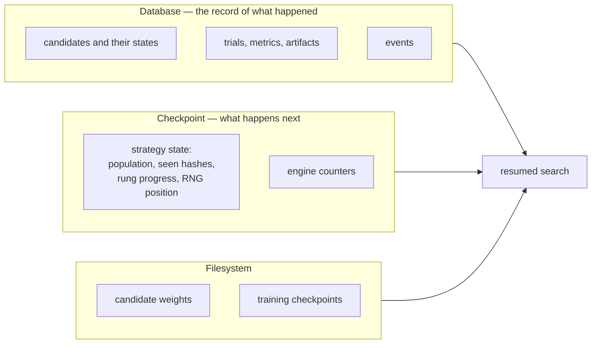
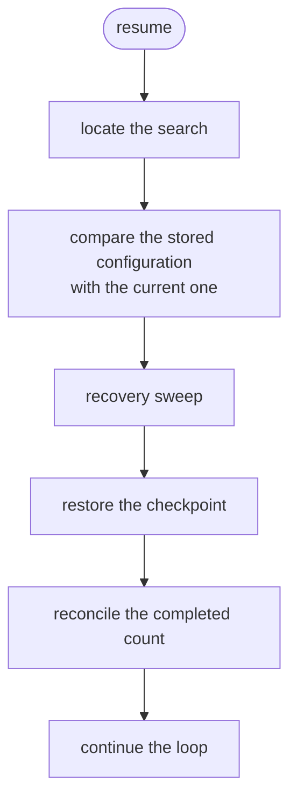

# Resuming a search

What happens when a search is interrupted, what is restored, and what is not.

## The short version

```bash
nas-engine resume --config configs/my-search.yaml
```

That is usually all there is to it. The rest of this page explains what that command does,
so that when something is unusual you know what to expect.

## When you need it

| Situation                            | Resumable?                                         |
| ------------------------------------ | -------------------------------------------------- |
| Ctrl-C during a search               | Yes                                                |
| The machine rebooted                 | Yes                                                |
| A job was pre-empted                 | Yes                                                |
| The process was OOM-killed           | Yes                                                |
| You want to extend a finished search | Yes — raise `max_evaluations` and resume           |
| The output directory was deleted     | No                                                 |
| You changed the search space         | Technically yes, but the halves are not comparable |

## What is restored



**The database** records what *has* happened. **The checkpoint** determines what happens
*next*. Restoring only the first would restart the strategy from scratch: random search
would replay its first proposals, evolution would rebuild an empty population, and
successive halving would forget which rung it was on.

| Restored                                  | Not restored                                                            |
| ----------------------------------------- | ----------------------------------------------------------------------- |
| Every candidate and its state             | Global PyTorch RNG state                                                |
| Every trial, metric, and artifact record  | In-flight evaluation progress (unless per-candidate checkpoints are on) |
| The strategy's population / rung progress | The wall-clock time already spent (accumulated separately)              |
| The strategy's exact RNG position         |                                                                         |
| Engine counters                           |                                                                         |
| Every hash already seen                   |                                                                         |

The global RNG is deliberately *not* restored: restoring PyTorch's RNG state across
processes and versions is fragile. Per-candidate seeds are re-derived from the persisted
master seed instead, which is version independent — and because those seeds come from the
architecture hash, a candidate's weights are identical whether it runs before or after a
resume.

## What happens on resume



### 1. Locate the search

Without `--search-id`, the engine finds the most recent search whose name matches
`project.name`, falling back to the most recent search of any name.

Be explicit when a database holds several experiments:

```bash
nas-engine resume --config configs/my-search.yaml --search-id 7492f071596c4b7c
```

### 2. Compare configurations

Differences are reported as **warnings**, not errors — adjusting the log level or the device
between segments is legitimate. Changes to the strategy, the space, the seeding, or the
objectives are listed *first*, because those invalidate the comparison between the two
halves:

```text
warnings:
  - the search strategy section changed since this search was created; results from before
    and after the resume are not directly comparable
  - section 'budget' differs from the stored configuration
```

An incompatible **configuration version** *is* an error:

```text
the stored configuration is version 2 but this build supports at most version 1; upgrade
nas-engine to resume this search
```

### 3. The recovery sweep

Candidates left in `RUNNING` had a process die under them. Each one:

- has its in-flight trials marked `INTERRUPTED`, with an error record, so the history says
  what happened rather than leaving a trial that never ends;
- returns to `QUEUED` if it has retries left, with `retry_count` incremented;
- moves to `FAILED` with `retry_exhausted_error` if it does not.

```text
warnings:
  - recovered 2 interrupted evaluation(s): 2 requeued, 0 abandoned
```

### 4. Restore the checkpoint

The checkpoint is validated before it is applied:

| Check                      | On mismatch                                                             |
| -------------------------- | ----------------------------------------------------------------------- |
| Format version             | `CheckpointVersionError`                                                |
| Required fields present    | `CheckpointError`                                                       |
| Strategy name matches      | `CheckpointError` — evolution state cannot load into successive halving |
| Configuration hash matches | A warning                                                               |

If no checkpoint exists — an interruption before the first one was written — the engine
warns and the strategy restarts its plan. Nothing is lost, because the engine rejects
re-proposed architectures as duplicates:

```text
warning: no strategy checkpoint was found for this search; the strategy restarted from its
initial state and may re-propose architectures that are already recorded (they will be
skipped as duplicates)
```

### 5. Reconcile the completed count

Subtle and necessary. Recovery can *undo* a completion: a candidate the crashed process had
already finished, but whose result was never persisted, goes back to the queue. The
checkpoint's counter still includes it, so without reconciliation the engine would believe
its budget was spent and would leave the recovered candidate queued forever — silently
returning fewer results than requested.

The database is authoritative, because it is what the sweep just updated.

## Extending a finished search

Raise the budget and resume:

```bash
nas-engine resume --config configs/my-search.yaml --set budget.max_evaluations=40
```

The strategy continues from its checkpointed position, so no architecture is re-proposed.
The configuration comparison warns that the budget changed, which is expected.

## Resume preserves the search's identity

An uninterrupted run and the same run split in two reach the same state. This is asserted,
not assumed:

```python
# tests/regression/test_determinism.py
def test_resume_reaches_the_same_state_as_an_uninterrupted_run(self, tmp_path):
    whole = run(max_evaluations=4)                  # uninterrupted
    first = run(max_evaluations=2)                  # split, part 1
    second = resume(first.search_id, max_evaluations=4)   # split, part 2
    assert sorted(h(second)) == sorted(h(whole))
```

## Per-candidate training checkpoints

By default, an interrupted candidate is retrained from scratch. For long per-candidate
training that is expensive, so:

```yaml
evaluation:
  save_training_checkpoints: true
```

The trainer then writes weights, optimiser state, scheduler state, and early-stopping
counters after each epoch, and resumes from the last one.

Restoring weights alone would not be enough — the optimiser's momentum buffers, the
scheduler's step counter, and the early-stopping counters are all part of the training
trajectory, and dropping any of them makes the resumed run different from the uninterrupted
one.

The cost is disk: one checkpoint per candidate per rung. Enable it when per-candidate
training takes minutes, not seconds.

## When resume is not the right answer

**A corrupt checkpoint.** Delete the offending checkpoint row and resume; the strategy
restarts its plan and duplicates are skipped:

```sql
DELETE FROM checkpoints WHERE search_id = '…' AND sequence = (
    SELECT MAX(sequence) FROM checkpoints WHERE search_id = '…'
);
```

Or resume from an earlier one, since checkpoints are append-only.

**A fundamentally changed configuration.** If the space or the strategy changed, the two
halves are measuring different things. Start a new search.

**A deleted output directory.** Nothing to resume from. The seed makes a fresh run
reproduce the original, but the results are gone.

## Programmatically

```python
from nas_engine import SearchConfig, SearchEngine

config = SearchConfig.from_yaml("configs/my-search.yaml")
engine = SearchEngine(config)
try:
    result = engine.resume()                       # or engine.resume(search_id)
    print(f"resumed: {result.resumed}")
    print(f"total evaluations: {result.engine_state.completed}")
    for warning in result.warnings:
        print(f"warning: {warning}")
finally:
    engine.close()
```

[`examples/resume_search.py`](../../examples/resume_search.py) runs a search, simulates a
crash by forcing a candidate back into `RUNNING`, and resumes — printing what happened at
each step.

## Handling Ctrl-C

Interrupting a search:

1. writes a final checkpoint;
2. marks the search `PAUSED`;
3. returns a `SearchResult` with `stop_reason = INTERRUPTED`;
4. exits with code 130.

```text
Search 7492f0… finished: the run was interrupted and can be resumed
  status : paused
  warnings:
    - the run was interrupted; resume it with 'nas-engine resume --search-id 7492f0…'
```

The candidate that was mid-evaluation stays in `RUNNING` and is recovered on the next
resume.

## See also

- [Running a search](running-a-search.md)
- [Reproducibility](../concepts/reproducibility.md) — why resume continues rather than
  replays.
- [Backup and recovery](../operations/backup-and-recovery.md)
- [Troubleshooting](troubleshooting.md)
